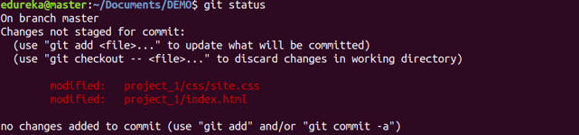
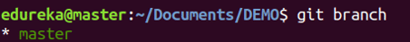
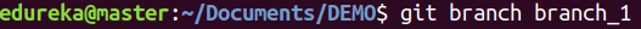
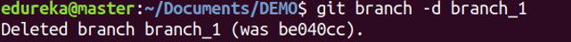

Poco tempo fa ho scritto un [articolo](/guide/che-cose-git/) elogiando **Git**, questo software di controllo versione del quale ormai **non posso più fare a meno**, quindi ho pensato di scrivere una guida per spiegare come usare GIT!

## MA COME SI USA CONCRETAMENTE GIT? E’ DIFFICILE DA USARE?

Partiamo dal fatto che “Git” può essere tradotto con “_idiota_“, questo quasi a dirci che è un software a prova di scemo…

Scherzi a parte no, è **molto semplice** da utilizzare, inoltre può essere un buon **punto di inizio per imparare ad utilizzare la CLI,** l’interfaccia a riga di comando!

## INSTALLAZIONE

Per **scaricare** Git è sufficiente andare su questo sito: [https://git-scm.com/](https://git-scm.com/)

Una volta aperto il link cliccate su “Download”, selezionate il vostro sistema operativo ed effettuate l’installazione.

Se utilizzate Windows vi consiglio di installare anche Git Bash, una CLI molto carina che utilizzo anche per molto altro.

## UTILIZZO

Una volta installato git potete aprire Git Bash e spostarvi nella cartella di un vostro progetto (tramite il comando _cd_. Es: _cd C:/Users/alby/progetti/app_)

Qui inserite il comando

```
git init
```

e git sarà presente nel vostro progetto con una cartella nascosta chiamata .git. Non aprite mai questa cartella, lasciatela semplicemente lì dove si trova, non vi farà del male.

Ora potete digitare, sempre su Git Bash, il seguente comando:

```
git add .
```

Questo **caricherà** tutti i file del progetto nella staging area, in attesa di essere approvati.

Dopodiché basterà scrivere

```
git commit -m “nome del commit”
```

Questo comando _committerà_ i vostri file, creerà cioè una versione del vostro progetto. Fra virgolette potete scrivere ad esempio “Primo commit”, nei successivi andrete ad indicare le modifiche effettuate (Es: Inserito login)

## GIT HUB

E’ anche possibile salvare i commit su github, in modo da poterli consultare e scaricare ovunque e permettere ad altri sviluppatori di consultare il nostro codice e migliorarlo!

Per fare questo bisogna avere un account GitHub e creare un nuovo Repository.

Dopo aver creato un nuovo repository GitHub vi indica già i comandi da eseguire per “riempirlo” con il vostro progetto in locale.

Per fare questo dovere inserire:

```
git remote add origin https://github.com[link al repository]
```

```
git push -u origin master
```

In questo modo avete il vostro progetto anche su GitHub. Per scaricarlo basterà usare il comando

```
git pull https://github.com[link al repository]
```

Questi sono i **comandi base**. Una volta creato il commit si possono fare altre modifiche al progetto e ridare i comandi add e commit.

Esistono **molti altri comandi** per utilizzare questo software. **Il modo migliore per impararli tutti è utilizzarli**, quindi inizia a sporcarti le mani e provali! **Non potrai più farne a meno**.

Qua di seguito inserisco una lista dei **comandi più utilizzat**i spiegati rapidamente.

## COMANDI PER GIT

### git config

Utilizzo: git config –global user.name “\[name\]”  

Utilizzo : git config –global user.email “\[email address\]”  

Questo comando imposta rispettivamente il nome dell’autore e l’indirizzo e-mail da utilizzare per i tuoi commit.


### git init

Utilizzo: git init \[repository name\]

Questo comando viene utilizzato per avviare un nuovo repository (progetto).


### git clone

Utilizzo: git clone \[url\]  

Questo comando viene utilizzato per clonare un repository da un URL esistente.


### git add

Utilizzo: git add \[file\]  

Questo comando aggiunge un file all’area di gestione temporanea.


Utilizzo: git add \*  

Questo comando aggiunge uno o più file all’area di gestione temporanea.


### git commit

Utilizzo: git commit -m “\[ Type in the commit message\]”  

Questo comando registra o l’istantanea dei file in modo permanente nella cronologia delle versioni.


### git status

Utilizzo: git status  

Questo comando elenca tutti i file che devono essere committati.



### git rm

Utilizzo: git rm \[file\]  

Questo comando cancella il file dalla directory di lavoro e mette in scena l’eliminazione.


### git log

Utilizzo : git log  

Questo comando viene utilizzato per elencare la cronologia delle versioni per il ramo corrente.


### git branch

Utilizzo: git branch  

Questo comando elenca tutti i branch locali nel repository corrente.



Utilizzo : git branch \[branch name\]  

Questo comando crea un nuovo branch.



Utilizzo : git branch -d \[branch name\]  

Questo comando elimina il branch.



### git checkout

Utilizzo : git checkout \[branch name\]  

Questo comando viene utilizzato per passare da un branch all’altro.


Utilizzo : git checkout -b \[branch name\]  

Questo comando crea un nuovo branch e passa anche a esso.


### git merge

Utilizzo : git merge \[branch name\]  

Questo comando unisce la cronologia del branch specificato nel branch corrente.


### git remote

Utilizzo : git remote add \[variable name\] \[Remote Server Link\]  

Questo comando viene utilizzato per connettere il repository locale al server remoto.


### git push

Utilizzo : git push \[variable name\] master  

Questo comando invia le modifiche da locale al repository remoto.


Utilizzo : git push \[variable name\] \[branch\]  

Questo comando invia i commit dei branch al repository remoto.


Utilizzo : git push –all \[variable name\]  

Questo comando invia tutti i branch al repository remoto.


Utilizzo : git push \[variable name\] :\[branch name\]  

Questo comando elimina un branch sul repository remoto.


### git pull

Utilizzo : git pull \[Repository Link\]  

Questo comando recupera e unisce le modifiche sul server remoto alla directory di lavoro.


