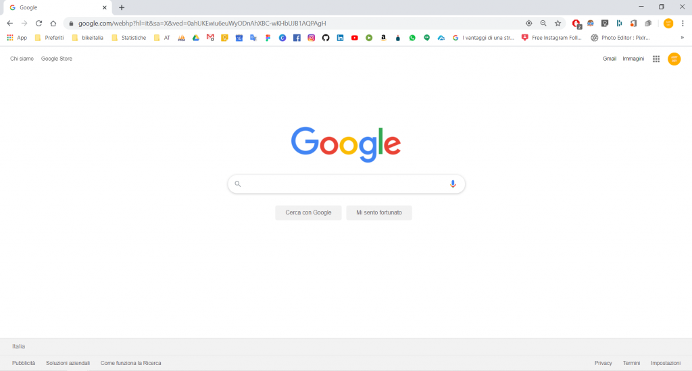
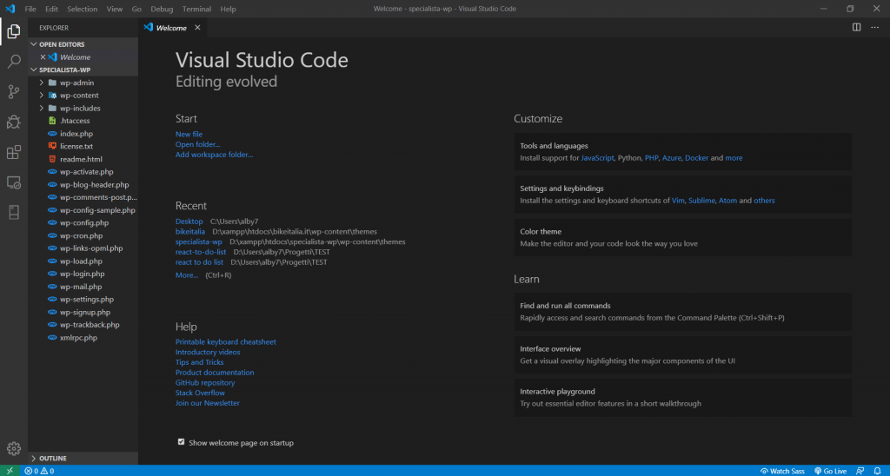
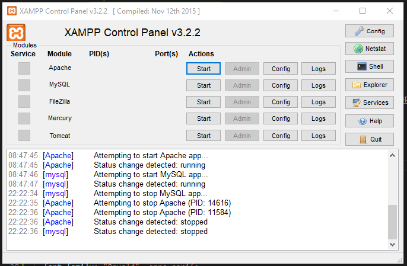
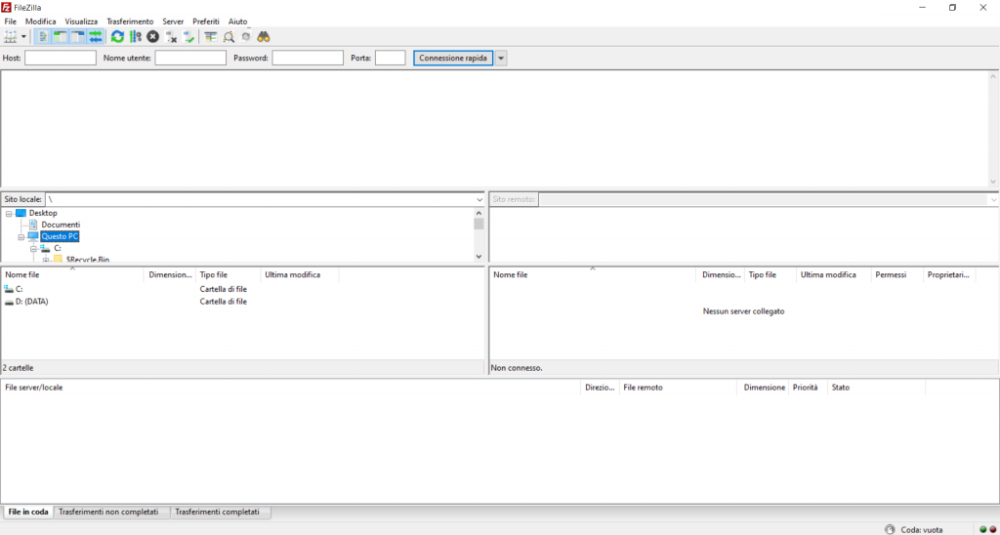

Ti stai appassionando al mondo della programmazione e vuoi iniziare a **sviluppare qualche sito web in WordPress**? Complimenti! Benvenuto nel fantastico mondo del **Web Development**!

Per cominciare dovrai installare i **programmi necessari** per scrivere i tuoi primi codici e riuscire a “_far girare_” ciò che hai scritto. In questo articolo vedremo rapidamente di quali software avremo bisogno.

Lasciamo da parte **l’eterna discussione** su quale sistema operativo sia migliore per una determinata cosa, sulle mode che portano a scegliere un pc rispetto ad un altro e cose di questo genere. Tutti i software presenti in questo articolo sono disponibili sia per **Windows** che per **Mac** che per **Linux**.

In questa guida ti indicherò i **migliori tool e programmi** grazie ai quali potrai **installare WordPress, sviluppare temi e plugin**, testare funzionalità e caricare le modifiche online.

Vediamo allora **cosa ci serve** per poter sviluppare siti web in **WordPress**.

## 1\. BROWSER

Se abbiamo intenzione di fare un po’ di sviluppo web, il **software fondamentale** che dobbiamo avere è un browser. Tutti i sistemi operativi posseggono un browser pre-installato, ma il mio consiglio è quello di utilizzare [**Google Chrome**](http://www.google.com/intl/it/chrome/). Questo browser è molto rapido ed offre una serie di **strumenti per sviluppatori** molto utile.

Non mi dilungo su questo punto perché probablimente stai già utilizzando Chrome oppure sai perfettamente cos’è.

Recentemente **Microsoft** ha rilasciato la nuova versione di [**Edge**](http://www.microsoft.com/en-us/edge). Lo sto testando da qualche tempo e ne sono veramente entusiasta, quindi anche il browser di casa Microsoft può essere una buona scelta!

## 2\. EDITOR DI TESTO

Per poter fare sviluppo web è necessario **scrivere del codice**, e per scrivere il codice occorre avere un **editor di testo**. E’ possibile scrivere codice anche con il blocco note, ma non è certo una soluzione ottimale.

Il mio consiglio è di utilizzare **[Visual Studio Code](http://code.visualstudio.com/)**, un software gratuito della Microsoft veramente fantastico!

Ricco di funzionalità ed estensioni, permette di gestire molto bene i progetti, anche grazie al **terminale** interno all’interfaccia. 

Questo è sicuramente il **programma esseziale** per qualsiasi programmatore

## 3\. SERVER LOCALE

Per poter “**_far girare_**” i nostri progetti sul nostro pc, è nevessario installare un server locale per far sì che funzionino.

Io utilizzo da anni [**XAMPP**](http://www.apachefriends.org/it/index.html), un software anch’esso gratuito che contiene in sè anche **MySQL**. Software utilissimo e semplice da utilizzare, permette in pochi minuti di configurare un server locale e iniziare il proprio progetto in **PHP**.

Fondamentale per la creazione di siti in **WordPress**, per progetti in framework PHP come **Laravel** o **CodeIgniter** oppure anche per un lavori in **Core PHP**.

## 4\. CLIENT FTP

Una volta terminato il nostro sito dobbiamo **caricarlo online**! 

Per fare questo è possibile utilizzare un **Client FTP** che ci permette di **connetterci all’hosting** e caricare i file del sito.

Il software più utilizzato per questo compito è sicuramente [**FileZilla**](http://filezilla-project.org/). Gratis, semplice ed intuitivo, è la scelta giusta per “tirare su” il tuo sito in maniera semplice, rapida e veloce.

## 5\. GRAFICA

Infine non dimentichiamo che ogni progetto ha in sè anche una parte grafica! 

Per **sviluppare i layout** dei vostri progetti vi consiglio l’utilizzo di [**Figma**](http://www.figma.com/). Uso da un po’ di tempo questo software e sono veramente soddisfatto, in più è **completamente gratuito**! Basterà inscriversi con l’account google e voilà! Potete iniziare a creare fantastici layout web ma non solo!

Tutti questi software sono **free** e **cross platform**, il prossimo purtroppo no.

Sto parlando di [**Photoshop**](http://www.adobe.com/it/products/photoshop.html?gclid=CjwKCAjwtajrBRBVEiwA8w2Q8PvEfIWtLKBGk-wtMLSQEQ1slHQCulhlLxYEG-ScQVPToYcZ2qNQQRoCVa0QAvD_BwE&sdid=8DN85NTV&mv=search&ef_id=CjwKCAjwtajrBRBVEiwA8w2Q8PvEfIWtLKBGk-wtMLSQEQ1slHQCulhlLxYEG-ScQVPToYcZ2qNQQRoCVa0QAvD_BwE:G:s&s_kwcid=AL!3085!3!340641313438!e!!g!!photoshop), un favoloso software di Adobe che permette di fare tutto ciò che desideriamo con foto e immagini. Sebbene molte di queste cose si possano fare anche con Figma, **non riesco ancora a staccarmi totalmente da questo software**, che rimane l’unico della mia configurazione **a pagamento**…

Se volete provare una valida alternativa esiste [**Gimp**](http://www.gimp.org/), che a quanto dicono dovrebbe essere molto potente. Purtroppo avendo iniziato con Photoshop e conoscendolo ormai discretamente bene non mi va di ricominciare da zero ad imparare un nuovo programma… Lascio a voi giudicare!

Questo è **tutto ciò che vi serve**! Ora potete inizare a sbizzarrirvi fra [**codice e design**](https://open.spotify.com/show/546eUw3PsRI1HUGbBUeghC) e creare i vostri primi progetti!

Grazie per aver letto questo articolo

_Buon codice!_
