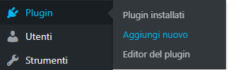
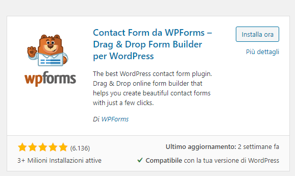
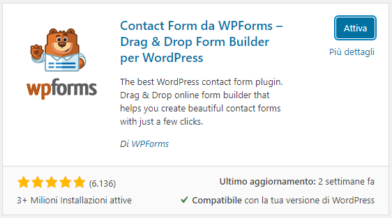
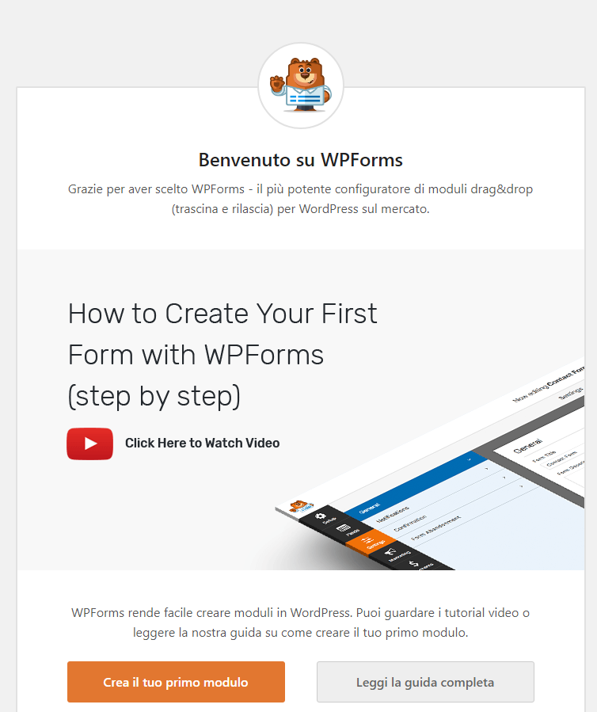
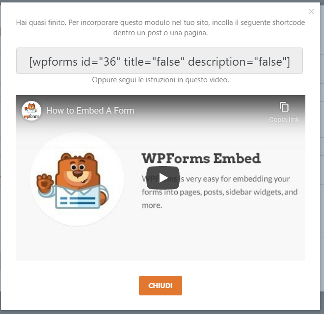

Se stai iniziando ad entrare nel mondo di WordPress avrai sicuramente sentito spesso parlare di **plugin**. Ma cosa sono? E come si utilizzano?

**Vediamolo insieme!**

## COSA SONO I PLUGIN WORDPRESS?

I plugin WordPress sono dei **pezzi di codice che creano una funzionalità**!

Questi pezzi di codice contenuti nei plugin consentono al core di WordPress di **aggiungere o migliorare le sue caratteristiche**!

Per esempio WordPress non prevede la possibilità di creare un **form contatti**, per farlo basterà scaricare ed installare un plugin e in questo modo potremo avere il nostro form pronto all’uso!

Nel corso degli anni WordPress è diventato sempre più famoso e il **numero** dei plugin è cresciuto **considerevolmente**! Questo è uno dei motivi per cui **WordPress è il CMS più utilizzato al mondo.**

Molti plugin sono **gratuiti**, ma esistono anche alcuni plugin a pagamento, che consentono di ampliare il nostro sito con funzionalità potentissime con cifre contenute.

## COME INSTALLARE UN PLUGIN

Vediamo ora **come si installa un plugin.** Installeremo una delle funzioni basilari che ogni sito dovrebbe avere: un **modulo di contatto.**

Per farlo utilizzeremo il plugin **[WPForms](http://it.wordpress.org/plugins/wpforms-lite/)**.

Questo plugin ci permetterà di creare un **modulo di contatto** in maniera semplice e veloce!

Per prima cosa **accediamo al backend** del nostro sito in WordPress (se non sai come si fa leggi le [guide precedenti](http://specialistawp.local/inizia-qui/inizia-qui-principiante/)) e clicchiamo su “**Plugin – Aggiungi nuovo**“

Ci troveremo di fronte ad una schermata come questa:

Qua dobbiamo andare in alto a destra, nella casella “**Ricerca plugin in corso…**” e qui dentro scrivere WP Forms.

La ricerca partirà in automatico e dopo pochi istanti dovremmo vedere questo plugin nell’elenco:

Ora non ci resta che cliccare su “**Installa ora**“.

Dopo che il plugin sarà installato possiamo attivarlo, cliccando su “**Attiva**“

Ora ci troveremo a questo punto:

Questo plugin rende la creazione dei form un’azione veramente **semplicissima**! Possiamo quindi **seguire la guida** che il plugin stesso ci fornisce e in meno di cinque minuti avremo il nostro form bello e funzionante!

Procediamo quindi con il cliccare sul pulsante arancione “**Crea il tuo primo modulo**“.

A questo punto possiamo premere su “**Semplice modulo di contatto**“. Il plugin procederà con la creazione di un form base. Quando avrà finito dovresti vedere una schermata come la seguente:

Sulla destra c’è l’anteprima del modulo, mentre sulla sinistra si possono aggiungere e modificare i campi che compongono il modulo.

Esiste anche una versione a pagamento di questo plugin, ma per dei form base è sufficiente quella **gratuita**.

A questo punto clicchiamo su “**Salva**” in alto a destra e poi su “Embed”.

Dopo aver cliccato “**Embed**” si aprirà una finestra come questa:

Quello scritto nel riquadro grigio scuro è uno **shortcode**: un codice che consente di far apparire qualcosa all’interno di un articolo o di una pagina.

A questo punto non dobbiamo far altro che **copiare questo shortcode** ed andarlo a **copiare nella pagina** dove vogliamo che appaia il nostro form di contatto.

Dopo aver copiato lo shortcode chiudiamo WP Forms (con la X in alto a destra) e clicchiamo su “**Pagine**” nel menù laterale.

Qui clicchiamo su “**Contatti**” per modificare la pagina che abbiamo [creato in precedenza](http://specialistawp.local/creiamo-le-pagine-del-nostro-primo-sito-web/).

Ora non ci resta che **incollare lo shortcode** nel contenuto della pagina e fare click su “**Aggiorna**” in alto a destra.

Se **andiamo a visualizzare** la nostra pagina contatti ora vedremo al suo interno **sarà apparso il modulo creato con WP Forms!**

_**Bello vero? Hai appena installato ed utilizzato il tuo primo plugin!**_
