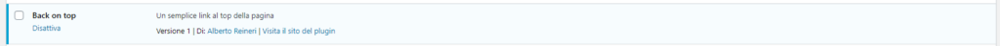

Hai imparato a **[creare un tema WordPress da zero](/guide/creare-un-tema-wordpress-da-zero-parte-1/)** e vuoi impratichirti anche con i **plugin**?

Sei nel posto giusto!

Creare un plugin per WordPress può essere una cosa semplicissima e molto veloce come complicatissima e molto lenta…

In questa guida vediamo semplicemente come **creare un plugin per WordPress funzionante.**

Creeremo un plugin che aggiunge il **back on top** del sito. Andremo a inserire una freccia verso l’alto nell’angolo in basso a destra della pagina. Cliccando su questa freccia avvieremo uno smooth scroll verso il top della pagina!

## CREARE IL PLUGIN

Creare un nuovo plugin **non è difficile.**

Per prima cosa rechiamoci nella **cartella dei plugin** di WordPress: _/wp-content/pluigns._

Ora qui dentro **creiamo una nuova cartella** con il nome “**back-on-top**” e apriamo la cartella con **VS Code**.

Creiamo adesso un **file** in questa cartella chiamato “_**back-on-top.php**_” e inseriamo questo codice al suo interno:

```
<?php

/**
 * Plugin Name: Back on top
 * Plugin URI: /
 * Description: Un semplice link al top della pagina
 * Version: 1
 * Author: Alby DEV
 * Author URI: http://albydev.net
 * Text Domain: back-on-top
 */
```

Questo codice **indicherà a WordPress l’esistenza del plugin.**

Se salviamo e andiamo nel backend in “**Plugins**” vedremo apparire “**Back on top**” nell’elenco. Possiamo quindi **attivarlo**.



Il plugin al momento **non fa assolutamente nulla**, ma l’abbiamo creato.

Vediamo ora come aggiungere una funzionalità al plugin.

## AGGIUNGERE FUNZIONALITÀ AL PLUGIN

Per poter aggiungere una funzionalità al nostro plugin occorre **agganciarsi ai vari hook di WordPress**. Nel nostro caso dobbiamo inserire una freccia in fondo alla pagina, quindi ci attaccheremo al footer.

Possiamo considerare il file back-on-top.php come un’**estensione del functions.php**. Ogni funzione che agguingiamo nel plugni verrà aggiunta al tema corrente.

### INSERIAMO IL CONTENUTO NEL FOOTER

```
add_action('wp_footer', 'back_on_top');
function back_on_top()
{
    ob_start();
?>
    <div class="back-on-top" onclick="scrollToTop()">
        <?php
        echo file_get_contents(plugin_dir_url(__FILE__) . "up.svg");
        ?>
    </div>
<?php
    $output = ob_get_contents();
    ob_end_clean();
    echo $output;
}
```

In questo modo abbiamo inserito sul fondo della nostra pagina **l’immagine up.svg** presente nella cartella del plugin.

**Puoi inserire l’immagine che preferisci**. Se inserisci un jpg o un png al posto di un svg puoi usare semplicemente il tag .

**_on\_start_** è una funzione che permette di inserire codice html e considerarlo come una **variabile php.**

Ora aggiungiamo un po’ di **CSS** per rendere sensata la grafica. Per semplificare inseriamo il CSS direttamente nel file php, giusto sopra il div “**back-on-top**“:

```
<style>
        .back-on-top {
            position: fixed;
            z-index: 99999;
            bottom: 30px;
            right: 30px;
            cursor: pointer
        }

        .back-on-top svg {
            width: 30px;
            height: 30px;
            fill: #444;
            transition: .3s;
        }

        .back-on-top svg:hover {
            fill: lightblue;
        }
    </style>
```

Adesso non ci resta che inserire un po’ di **Javascript** per effettuare lo smooth scroll al top della pagina. Questo può essere fatto in molti modi, da vanilla Javascript a JQuery.

Per rendere le cose minimali inseriamo del **vanilla Javascript** dopo il div “**back-on-top**“:

```
<script>
        // Smooth scroll to top
        const scrollToTop = () => {
            const c = document.documentElement.scrollTop || document.body.scrollTop;
            if (c > 0) {
                window.requestAnimationFrame(scrollToTop);
                window.scrollTo(0, c - c / 8);
            }
        };
        scrollToTop();
    </script>
```

**_E voilà!_**

**Il plugin è bello che pronto.** Puoi salvare e se tutto è andato a buon fine dovresti vedere una freccia verso l’alto nell’angolo in basso a destra del sito. Cliccando sulla freccia dovresti tornare al top della pagina.


**_Complimenti! Hai appena creato il tuo primo plugin!!!_**

```
<?php

/**
 * Plugin Name: Back on top
 * Plugin URI: /
 * Description: Un semplice link al top della pagina
 * Version: 1
 * Author: Alby DEV
 * Author URI: http://albydev.net
 * Text Domain: back-on-top
 */

add_action('wp_footer', 'back_on_top');
function back_on_top()
{
    ob_start();
?>
    <style>
        .back-on-top {
            position: fixed;
            z-index: 99999;
            bottom: 30px;
            right: 30px;
            cursor: pointer
        }

        .back-on-top svg {
            width: 30px;
            height: 30px;
            fill: #444;
            transition: .3s;
        }

        .back-on-top svg:hover {
            fill: lightblue;
        }
    </style>
    <div class="back-on-top" onclick="scrollToTop()">
        <?php
        echo file_get_contents(plugin_dir_url(__FILE__) . "up.svg");
        ?>
    </div>

    <script>
        // Smooth scroll to top
        const scrollToTop = () => {
            const c = document.documentElement.scrollTop || document.body.scrollTop;
            if (c > 0) {
                window.requestAnimationFrame(scrollToTop);
                window.scrollTo(0, c - c / 8);
            }
        };
        scrollToTop();
    </script>
<?php
    $output = ob_get_contents();
    ob_end_clean();
    echo $output;
}
```

_[<< Parte 3](/guide/creare-un-tema-wordpress-da-zero-parte-3/)_[](.local/assistenza/)
