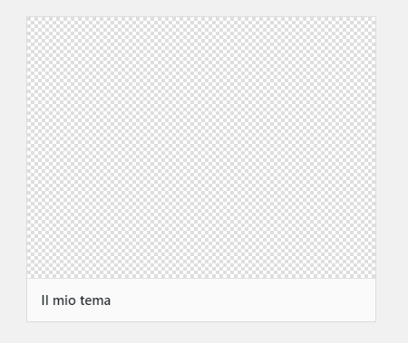
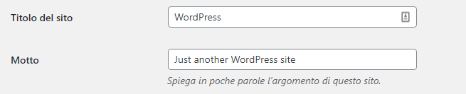

**WordPress** è una piattaforma **fantastica**! Permette di creare **siti web di ogni tipo** in maniera semplice e **veloce**, grazie all’infinita quantità di **temi** e **plugin** disponibili, moltissimi dei quali in maniera gratuita.

Però **quando si vuole fare il salto di livello** ed avere un sito web veramente **performante**, allora conviene utilizzare un **tema sviluppato da zero**, in grado di implementare tutte le funzioni necessarie nella maniera più performante!

**Niente errori** in console, niente stringhe in inglese, niente codici sparsi in giro per il sito, niente css e js inutili… Solo ciò che serve realmente, sviluppato nel modo corretto.

**Oggi vediamo come creare un tema WordPress da zero!**

Mettiti comodo e **prenditi il tuo tempo**, ci vorrà un po’, ma alla fine avrai realizzato **il tuo primo tema WordPress** funzionante e nel rispetto di tutte le best practice.

_**Partiremo da un’installazione di WordPress, se non sai come installare il CMS ti consiglio di seguire le guide per [Inizia Qui](.local/inizia-qui/inizia-qui-principiante/).**_

_Questo tutorial è suddiviso in 3 parti, alla fine potrai scaricare l’intero tema che creeremo insieme per confrontarlo e correggere eventuali errori. Ti consiglio di seguire le varie parti e scaricare il tema solo alla fine, ma se ti servisse prima lo puoi trovare sul fondo della [parte 3](/guide/creare-un-tema-wordpress-da-zero-parte-3/)._

## CREIAMO IL NOSTRO TEMA

Se apri la cartella del tuo sito **WordPress** noterai che all’interno sono presenti **3 cartelle**:

- wp-admin
- wp-content
- wp-includes

A noi per il momento interessa solamente la “**wp-content**“, quindi iniziamo ad **aprirla**.

All’interno di wp-content apriamo ora la cartella “**themes**“, che come puoi intuire contiene **i temi del progetto.**

**Procediamo quindi a creare il nostro primo tema!**

Creiamo una **nuova cartella** e la chiamiamo “**il-mio-tema**“, dopodiché apriamo la cartella con **[VS Code](http://code.visualstudio.com/)**. (Se non sai come fare questo passaggio visualizza le [guide per principianti](/guide/le-basi-dellhtml/))

Un **tema WordPress** per essere riconosciuto necessita solamente di **2 file:**

- style.css
- index.php

**creiamo quindi questi 2 file all’interno della cartella “il-mio-tema”** e inseriamo questo codice in “**style.css**“, in modo da indicare a WordPress i dati del tema:

```
/*
Theme Name: Il mio tema
Author: Specialista WP
Description: Il mio primo tema WordPress
Version: 0.0.1
*/
```

Puoi **sostituire** l’autore con il tuo nome, così come il nome del tema e la descrizione.

Se ora salvi il file CSS e vai nel backend di WordPress in “**Aspetto – Temi**” vedrai comparire il nostro tema!



Puoi **attivare il tema** e _voilà_! Il tema è fatto!

Non è poi tanto complicato vero? Già, però ora il tema è **vuoto**, occorre riempirlo!

Inizia con l’inserire questo codice nella “**index.php**“, è un **layout di base** creato con [bootstrap](/guide/le-basi-di-bootstrap/) sul quale andremo a costruire il nostro sito:

**index.html**

```
<!DOCTYPE html>
<html lang="it">

<head>
    <meta charset="utf-8">
    <meta http-equiv="X-UA-Compatible" content="IE=edge">
    <meta name="viewport" content="width=device-width, initial-scale=1">
    <!-- I 3 meta tags qua sopra DEVONO essere inseriti come primi -->
    <meta name="description" content="">
    <meta name="author" content="">

    <title>Il mio primo tema</title>

    <!-- Bootstrap core CSS -->
    <link href="http://stackpath.bootstrapcdn.com/bootstrap/4.3.1/css/bootstrap.min.css" rel="stylesheet">

</head>

<body>

    <nav class="navbar navbar-expand-lg navbar-light bg-light">
        <div class="container">
            <a class="navbar-brand" href="#">Il mio primo tema</a>
            <button class="navbar-toggler" type="button" data-toggle="collapse" data-target="#navbarSupportedContent" aria-controls="navbarSupportedContent" aria-expanded="false" aria-label="Toggle navigation">
                <span class="navbar-toggler-icon"></span>
            </button>

            <div class="collapse navbar-collapse" id="navbarSupportedContent">
                <ul class="navbar-nav ml-auto">
                    <li class="nav-item active">
                        <a class="nav-link" href="#">Home <span class="sr-only">(current)</span></a>
                    </li>
                    <li class="nav-item">
                        <a class="nav-link" href="#">Chi sono</a>
                    </li>
                    <li class="nav-item">
                        <a class="nav-link" href="#">Blog</a>
                    </li>
                    <li class="nav-item">
                        <a class="nav-link" href="#">Contatti</a>
                    </li>
                </ul>
            </div>
        </div>
    </nav>


    <div class="container mt-5">

        <div class="row">
            <!-- CONTENUTO -->
            <div class="col-sm-8">

                <!-- ARTICOLO -->
                <div class="articolo-list">
                    <!-- TITOLO -->
                    <h2 class="">Il mio articolo</h2>
                    <!-- META -->
                    <p>15 luglio 2020 - Scritto da <a href="#">Alberto</a></p>
                    <!-- CONTENT -->
                    <p>
                        Lorem ipsum dolor sit amet, consectetur adipiscing elit. Pellentesque et justo ultrices, blandit nulla in, convallis metus. Nullam et mollis orci.
                        Nulla magna augue, accumsan in metus ut, pulvinar facilisis libero. Aliquam erat volutpat. Nulla lectus tortor, lacinia id imperdiet ut, sagittis
                        consectetur magna. Maecenas laoreet sodales tristique. [...]
                    </p>
                </div>
                <!-- /ARTICOLO -->

                <!-- ARTICOLO -->
                <div class="articolo-list mt-5">
                    <!-- TITOLO -->
                    <h2 class="">Il mio articolo 2</h2>
                    <!-- META -->
                    <p>16 luglio 2020 - Scritto da <a href="#">Alberto</a></p>
                    <!-- CONTENT -->
                    <p>
                        Lorem ipsum dolor sit amet, consectetur adipiscing elit. Pellentesque et justo ultrices, blandit nulla in, convallis metus. Nullam et mollis orci.
                        Nulla magna augue, accumsan in metus ut, pulvinar facilisis libero. Aliquam erat volutpat. Nulla lectus tortor, lacinia id imperdiet ut, sagittis
                        consectetur magna. Maecenas laoreet sodales tristique. [...]
                    </p>
                </div>
                <!-- /ARTICOLO -->

                <!-- ARTICOLO -->
                <div class="articolo-list mt-5">
                    <!-- TITOLO -->
                    <h2 class="">Il mio articolo 3</h2>
                    <!-- META -->
                    <p>17 luglio 2020 - Scritto da <a href="#">Alberto</a></p>
                    <!-- CONTENT -->
                    <p>
                        Lorem ipsum dolor sit amet, consectetur adipiscing elit. Pellentesque et justo ultrices, blandit nulla in, convallis metus. Nullam et mollis orci.
                        Nulla magna augue, accumsan in metus ut, pulvinar facilisis libero. Aliquam erat volutpat. Nulla lectus tortor, lacinia id imperdiet ut, sagittis
                        consectetur magna. Maecenas laoreet sodales tristique. [...]
                    </p>
                </div>
                <!-- /ARTICOLO -->

                <!-- NAVIGATION LINKS -->
                <nav aria-label="Page navigation example">
                    <ul class="pagination justify-content-center mb-5">
                        <li class="page-item disabled">
                            <a class="page-link" href="#" tabindex="-1" aria-disabled="true">Precedente</a>
                        </li>
                        <li class="page-item"><a class="page-link" href="#">1</a></li>
                        <li class="page-item"><a class="page-link" href="#">2</a></li>
                        <li class="page-item"><a class="page-link" href="#">3</a></li>
                        <li class="page-item">
                            <a class="page-link" href="#">Successivo</a>
                        </li>
                    </ul>
                </nav>
                <!-- /NAVIGATION LINKS -->
            </div>
            <!-- /CONTENUTO -->

            <!-- SIDEBAR -->
            <div class="col-sm-3 col-sm-offset-1 blog-sidebar">
                <div>
                    <h4>Chi sono</h4>
                    <p>Etiam porta <em>sem malesuada magna</em> mollis euismod. Cras mattis consectetur purus sit amet fermentum. Aenean lacinia bibendum nulla sed consectetur.</p>
                </div>
                <div>
                    <h4>Ultimi articoli</h4>
                    <ol class="list-unstyled">
                        <li><a href="#">Il mio articolo 1</a></li>
                        <li><a href="#">Il mio articolo 2</a></li>
                        <li><a href="#">Il mio articolo 3</a></li>

                    </ol>
                </div>
                <div>
                    <h4>Social</h4>
                    <ol class="list-unstyled">
                        <li><a href="#">GitHub</a></li>
                        <li><a href="#">Twitter</a></li>
                        <li><a href="#">Facebook</a></li>
                    </ol>
                </div>
            </div>
            <!-- /SIDEBAR -->

        </div><!-- /.row -->

    </div><!-- /.container -->

    <footer>
        <div class="container text-center mb-5">
            <p>Sito realizzato da <a href="">Specialista WP!</a></p>
        </div>
    </footer>


    <!-- Bootstrap core JavaScript
    ================================================== -->
    <!-- Placed at the end of the document so the pages load faster -->
    <script src="http://ajax.googleapis.com/ajax/libs/jquery/1.11.3/jquery.min.js"></script>
    <script src="http://maxcdn.bootstrapcdn.com/bootstrap/3.3.5/js/bootstrap.min.js"></script>
</body>

</html>
```

Se ora **salvi** e **_refreshi_** la home del sito vedrai del contenuto!

La pagina è commentata, quindi dovresti riuscire a capire bene il codice al suo interno.

_Ricorda sempre di commentare il codice indicando cosa stai facendo, potrà aiutare i tuoi collaboratori ma anche il te stesso del futuro quando ritornerà al codice dopo molto tempo!_

**Ora procediamo con la creazione del tema!**

## DIVIDERE IN SEZIONI

Ora esiste solamente index.php, ma noi vogliamo creare un **tema vero e proprio**, che avrà delle parti di layout che si **ripeteranno** spesso e altre parti da aggiornare **dinamicamente**.

Procediamo quindi a **dividere il layout** del nostro sito in quattro sezioni:

- header.php
- footer.php
- sidebar.php
- content.php

**Creiamo** questi **quattro file** nella cartella del nostro tema ed andiamo a **spezzettare la index.php** in questo modo:

**heder.php**

```
<!DOCTYPE html>
<html lang="it">

<head>
    <meta charset="utf-8">
    <meta http-equiv="X-UA-Compatible" content="IE=edge">
    <meta name="viewport" content="width=device-width, initial-scale=1">
    <!-- I 3 meta tags qua sopra DEVONO essere inseriti come primi -->
    <meta name="description" content="">
    <meta name="author" content="">

    <title>Il mio primo tema</title>

    <!-- Bootstrap core CSS -->
    <link href="http://stackpath.bootstrapcdn.com/bootstrap/4.3.1/css/bootstrap.min.css" rel="stylesheet">

</head>

<body>

    <nav class="navbar navbar-expand-lg navbar-light bg-light">
        <div class="container">
            <a class="navbar-brand" href="#">Il mio primo tema</a>
            <button class="navbar-toggler" type="button" data-toggle="collapse" data-target="#navbarSupportedContent" aria-controls="navbarSupportedContent" aria-expanded="false" aria-label="Toggle navigation">
                <span class="navbar-toggler-icon"></span>
            </button>

            <div class="collapse navbar-collapse" id="navbarSupportedContent">
                <ul class="navbar-nav ml-auto">
                    <li class="nav-item active">
                        <a class="nav-link" href="#">Home <span class="sr-only">(current)</span></a>
                    </li>
                    <li class="nav-item">
                        <a class="nav-link" href="#">Chi sono</a>
                    </li>
                    <li class="nav-item">
                        <a class="nav-link" href="#">Blog</a>
                    </li>
                    <li class="nav-item">
                        <a class="nav-link" href="#">Contatti</a>
                    </li>
                </ul>
            </div>
        </div>
    </nav>


    <div class="container mt-5">

        <div class="row">
```

**footer.php**

```

            </div><!-- /.row -->

</div><!-- /.container -->

    <footer>
        <div class="container text-center mb-5">
            <p>Sito realizzato da <a href="">Specialista WP!</a></p>
        </div>
    </footer>


    <!-- Bootstrap core JavaScript
    ================================================== -->
    <!-- Placed at the end of the document so the pages load faster -->
    <script src="http://ajax.googleapis.com/ajax/libs/jquery/1.11.3/jquery.min.js"></script>
    <script src="http://maxcdn.bootstrapcdn.com/bootstrap/3.3.5/js/bootstrap.min.js"></script>
</body>

</html>
```

**sidebar.php**

```
            <!-- SIDEBAR -->
            <div class="col-sm-3 col-sm-offset-1 blog-sidebar">
                <div>
                    <h4>Chi sono</h4>
                    <p>Etiam porta <em>sem malesuada magna</em> mollis euismod. Cras mattis consectetur purus sit amet fermentum. Aenean lacinia bibendum nulla sed consectetur.</p>
                </div>
                <div>
                    <h4>Ultimi articoli</h4>
                    <ol class="list-unstyled">
                        <li><a href="#">Il mio articolo 1</a></li>
                        <li><a href="#">Il mio articolo 2</a></li>
                        <li><a href="#">Il mio articolo 3</a></li>

                    </ol>
                </div>
                <div>
                    <h4>Social</h4>
                    <ol class="list-unstyled">
                        <li><a href="#">GitHub</a></li>
                        <li><a href="#">Twitter</a></li>
                        <li><a href="#">Facebook</a></li>
                    </ol>
                </div>
            </div>
            <!-- /SIDEBAR -->
```

**content.php**

```


            <!-- CONTENUTO -->
            <div class="col-sm-8">

                <!-- ARTICOLO -->
                <div class="articolo-list">
                    <!-- TITOLO -->
                    <h2 class="">Il mio articolo</h2>
                    <!-- META -->
                    <p>15 luglio 2020 - Scritto da <a href="#">Alberto</a></p>
                    <!-- CONTENT -->
                    <p>
                        Lorem ipsum dolor sit amet, consectetur adipiscing elit. Pellentesque et justo ultrices, blandit nulla in, convallis metus. Nullam et mollis orci.
                        Nulla magna augue, accumsan in metus ut, pulvinar facilisis libero. Aliquam erat volutpat. Nulla lectus tortor, lacinia id imperdiet ut, sagittis
                        consectetur magna. Maecenas laoreet sodales tristique. [...]
                    </p>
                </div>
                <!-- /ARTICOLO -->

                <!-- ARTICOLO -->
                <div class="articolo-list mt-5">
                    <!-- TITOLO -->
                    <h2 class="">Il mio articolo 2</h2>
                    <!-- META -->
                    <p>16 luglio 2020 - Scritto da <a href="#">Alberto</a></p>
                    <!-- CONTENT -->
                    <p>
                        Lorem ipsum dolor sit amet, consectetur adipiscing elit. Pellentesque et justo ultrices, blandit nulla in, convallis metus. Nullam et mollis orci.
                        Nulla magna augue, accumsan in metus ut, pulvinar facilisis libero. Aliquam erat volutpat. Nulla lectus tortor, lacinia id imperdiet ut, sagittis
                        consectetur magna. Maecenas laoreet sodales tristique. [...]
                    </p>
                </div>
                <!-- /ARTICOLO -->

                <!-- ARTICOLO -->
                <div class="articolo-list mt-5">
                    <!-- TITOLO -->
                    <h2 class="">Il mio articolo 3</h2>
                    <!-- META -->
                    <p>17 luglio 2020 - Scritto da <a href="#">Alberto</a></p>
                    <!-- CONTENT -->
                    <p>
                        Lorem ipsum dolor sit amet, consectetur adipiscing elit. Pellentesque et justo ultrices, blandit nulla in, convallis metus. Nullam et mollis orci.
                        Nulla magna augue, accumsan in metus ut, pulvinar facilisis libero. Aliquam erat volutpat. Nulla lectus tortor, lacinia id imperdiet ut, sagittis
                        consectetur magna. Maecenas laoreet sodales tristique. [...]
                    </p>
                </div>
                <!-- /ARTICOLO -->

                <!-- NAVIGATION LINKS -->
                <nav aria-label="Page navigation example">
                    <ul class="pagination justify-content-center mb-5">
                        <li class="page-item disabled">
                            <a class="page-link" href="#" tabindex="-1" aria-disabled="true">Precedente</a>
                        </li>
                        <li class="page-item"><a class="page-link" href="#">1</a></li>
                        <li class="page-item"><a class="page-link" href="#">2</a></li>
                        <li class="page-item"><a class="page-link" href="#">3</a></li>
                        <li class="page-item">
                            <a class="page-link" href="#">Successivo</a>
                        </li>
                    </ul>
                </nav>
                <!-- /NAVIGATION LINKS -->
            </div>
            <!-- /CONTENUTO -->
```

Ora non ci resta che richiamare i vari pezzi di contenuto nella index.php, in modo da montare il sito, in questo modo:

**index.php**

```
<?php get_header(); ?>

<?php get_template_part( 'content', get_post_format() ); ?>

<?php get_sidebar(); ?>

<?php get_footer(); ?>
```

Ora la nostra index.php è **molto più semplice** no?

Le funzioni _get\_header()_, _get\_sidebar()_ e _get\_footer()_ vanno automaticamente ad inserire i fine _header.php_, _sidebar.php_ e _footer.php_.

Per inserire un file diverso abbiamo utilizzato la funzione _get\_template\_part()_ indicando il nome del file php da cui prendere il codice.

Nella programmazione è molto importante **suddividere i contenuti** in parti più piccole, in modo da rendere i file più semplici e facilmente leggibili.

## IMPOSTAZIONI PRINCIPALI

Vediamo ora come **recuperare** alcune delle **informazioni principali** del nostro sito.

Nel **backend** puoi impostare un nome e una descrizione al tuo sito, nella sezione “**Impostazioni – Generali**“.



**Inserisci** il **titolo** del sito e un **motto**. Ora vediamo come recuperare questi dati nel **frontend**!

Andiamo in **header.php** e modifichiamo il **titolo** nella navbar del sito.

Eliminiamo quindi la scritta “**Il mio primo tema**” e la sostituiamo con

```
<?php echo get_bloginfo( 'name' ); ?>
```

In questo modo **il nome del sito sarà dinamico.**

Possiamo anche inserire il **motto** del sito con questa funzione:

```
<?php echo get_bloginfo( 'description' ); ?>
```

Infine possiamo impostare **i link alla home del sito** sul titolo, in questo modo:

```
<a class="navbar-brand" href="<?php echo esc_url( home_url( '/' ) ); ?>"><?php echo get_bloginfo( 'name' ); ?></a>
```

Molto bene! **Abbiamo iniziato a rendere dinamico il nostro sito!** Ora buttiamoci in qualcosa di più complicato ma **fondamentale**!

## IL LOOP

**Il loop sta alla base di ogni tema WordPress**. Consente di inserire una serie di dati recuperandoli dal database.

Possiamo utilizzarlo per inserire l’elenco degli articoli, delle pagine, di una determinata categoria, di sezioni speciali etc.

Tutti i contenuti in WordPress vengono generati da loop! Possiamo dire che **è la funzione più importante di tutte!**

Nel **backend** al momento abbiamo solamente **l’articolo** di default: “Ciao mondo!”, vediamo come **farlo comparire nella home page del sito.**

Il **loop** di WordPress è molto semplice:

```
<?php
if (have_posts()) :
    while (have_posts()) : the_post();
?>

        <!-- Contenuto del loop -->

<?php
    endwhile;
endif;
?>
```

Direi che **si spiega** abbastanza **da solo**.

Se ci sono dei post allora inizia il loop, nel quale inserisce i post finché ce ne sono.

Proviamo ad **inserire il loop nella nostra home page**, in index.php

**index.php**

```
<?php get_header(); ?>

<?php
if (have_posts()) :
    while (have_posts()) : the_post();

        get_template_part('content', get_post_format());

    endwhile;
endif;
?>

<?php get_sidebar(); ?>

<?php get_footer(); ?>
```

Ora **rendiamo dinamico il contenuto** all’interno del file content.php

**content.php**

```


            <!-- CONTENUTO -->
            <div class="col-sm-8">

                <!-- ARTICOLO -->
                <div class="articolo-list">
                    <!-- TITOLO -->
                    <h2 class=""><?php the_title(); ?></h2>
                    <!-- META -->
                    <p><?php the_date('d/m/Y'); ?>  - Scritto da <a href="#"><?php the_author(); ?></a></p>
                    <!-- CONTENT -->
                    <?php the_content(); ?>

                </div>
                <!-- /ARTICOLO -->

                <!-- NAVIGATION LINKS -->
                <nav aria-label="Page navigation example">
                    <ul class="pagination justify-content-center mb-5">
                        <li class="page-item disabled">
                            <a class="page-link" href="#" tabindex="-1" aria-disabled="true">Precedente</a>
                        </li>
                        <li class="page-item"><a class="page-link" href="#">1</a></li>
                        <li class="page-item"><a class="page-link" href="#">2</a></li>
                        <li class="page-item"><a class="page-link" href="#">3</a></li>
                        <li class="page-item">
                            <a class="page-link" href="#">Successivo</a>
                        </li>
                    </ul>
                </nav>
                <!-- /NAVIGATION LINKS -->
            </div>
            <!-- /CONTENUTO -->
```

Benissimo! Ora in home page compare solamente il nostro primo articolo.

Prova a **creare un nuovo articolo** nel backend e a pubblicarlo, lo vedrai comparire anche nella home page!

**Grande! Stai iniziando a fare sul serio con WordPress!**

Se vuoi continuare a sviluppare il tuo primo tema WordPress da zero prosegui con la [parte 2](/guide/creare-un-tema-wordpress-da-zero-parte-2/)!

[Parte 2 >>](/guide/creare-un-tema-wordpress-da-zero-parte-2/)
