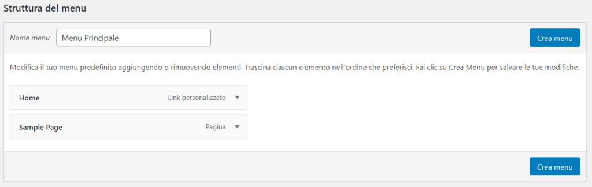
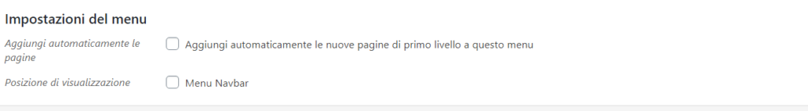
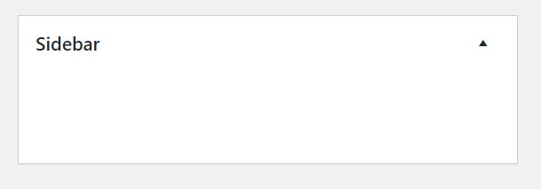
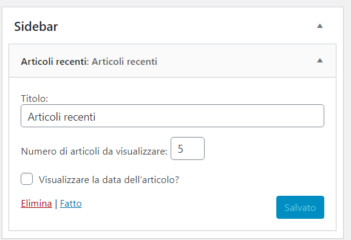
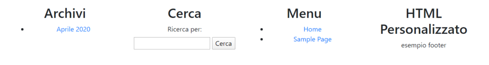

Nella **[parte 1](/guide/creare-un-tema-wordpress-da-zero-parte-1/)** di questa guida per **creare un tema WordPress da zero** abbiamo iniziato a creare in nostro primo tema WordPress, creando **header**, **footer** e **sidebar** e imparando come funziona il **loop** di WordPress.

Ora andiamo a **rendere dinamico** il contenuto delle varie sezioni!

## MENU

WordPress permette di impostare dei **menu**, nella sezione “**Aspetto – Menu**“.

Questi menu **creati nel backend** possono essere **inseriti nel frontend**, rendendo così eventuali modifiche molto semplici ed immediate.

**Vediamo come fare.**

Per prima cosa dobbiamo **abilitare il nostro tema all’utilizzo dei menu**. Se infatti provi ad andare nel backend a certare la sezione “Aspetto – Menu” ora non la troverai ancora.

Per abilitarla dobbiamo creare quello che sarà il file più importante di tutto il tema: _**functions.php**_.

Creiamo quindi un file chiamato _functions.php_ e inseriamo al suo interno questo codice:

```
<?php
//Setup del tema
function il_mio_tema_setup() {

//Imposto il menù per la navbar
    register_nav_menus(array(
		'navigation' => __( 'Menu Navbar','il-mio-tema'),
	));

}

add_action('after_setup_theme', 'il_mio_tema_setup');
```

Abbiamo creato una funzione di **setup del tema**, che utilizzeremo ancora in seguito per inserire altre personalizzazioni.

Qua abbiamo **registrato un nuovo menu** attraverso la funzione _register\_nav\_menus_ e l’abbiamo chiamato ‘**Menu Navbar**‘.

Se ora andiamo nel **backend** vedremo che la sezione “Aspetto – Menu” è attiva e utilizzabile.

Procediamo quindi a **creare un nuovo menù:**



Per il momento inseriamo solamente la home page e la pagina di esempio di default di WordPress, giusto per avere del contenuto al suo interno e clicchiamo su “**Crea menu**“.

Poi possiamo impostare il menù nella **posizione** “Menù navbar”:



Ora non ci resta che **inserire questo menù nella nostra barra di navigazione**, nell’header del tema.

Apriamo quindi _header.php_ e sostituiamo l'<ul> della nav con questo:

```
            <div class="collapse navbar-collapse" id="navbarSupportedContent">
                <?php
                $args = array(
                    'theme_location' => 'navigation',
                    'depth'      => 2,
                    'container' => false,
                    'menu_class' => 'navbar-nav ml-auto',
                    'add_li_class'  => 'nav-item',
                    'link_class'   => 'nav-link',
                    'walker'     => new Bootstrap_Walker_Nav_Menu()

                );

                ?>
                <?php wp_nav_menu($args); ?>
            </div>
```

IMPORTANTE: per selezionare il giusto menù abbiamo inserito il theme\_location uguale al nome di registrazione del menu inserito in functions.php.

Per far funzionare correttamente il **dropdown** di bootstrap dobbiamo ancora aggiungere una funzione che permetta di gestire i vari sottomenù. Questa funzione è chiamata “**walker**“, puoi semplicemente incollare questo codice nel _functions.php_:

```
// Custom Walker Class for Bootstrap Menu
add_action( 'after_setup_theme', 'bootstrap_setup' );

if ( ! function_exists( 'bootstrap_setup' ) ):

  function bootstrap_setup(){

    class Bootstrap_Walker_Nav_Menu extends Walker_Nav_Menu {


      function start_lvl( &$output, $depth = 0, $args = array() ) {

        $indent = str_repeat( "\t", $depth );
        $output    .= "\n$indent<ul class=\"dropdown-menu\">\n";

      }

      function start_el( &$output, $item, $depth = 0, $args = array(), $id = 0 ) {

        $indent = ( $depth ) ? str_repeat( "\t", $depth ) : '';

        $li_attributes = '';
        $class_names = $value = '';

        $classes = empty( $item->classes ) ? array() : (array) $item->classes;
        $classes[] = ($args->walker->has_children) ? 'dropdown' : '';
        $classes[] = ($item->current || $item->current_item_ancestor) ? 'active' : '';
        $classes[] = 'menu-item-' . $item->ID;
        $classes[] = 'nav-item';


        $class_names = join( ' ', apply_filters( 'nav_menu_css_class', array_filter( $classes ), $item, $args ) );
        $class_names = ' class="' . esc_attr( $class_names ) . '"';

        $id = apply_filters( 'nav_menu_item_id', 'menu-item-'. $item->ID, $item, $args );
        $id = strlen( $id ) ? ' id="' . esc_attr( $id ) . '"' : '';

        $output .= $indent . '<li' . $id . $value . $class_names . $li_attributes . '>';

        $attributes  = ! empty( $item->attr_title ) ? ' title="'  . esc_attr( $item->attr_title ) .'"' : '';
        $attributes .= ! empty( $item->target )     ? ' target="' . esc_attr( $item->target     ) .'"' : '';
        $attributes .= ! empty( $item->xfn )        ? ' rel="'    . esc_attr( $item->xfn        ) .'"' : '';
        $attributes .= ! empty( $item->url )        ? ' href="'   . esc_attr( $item->url        ) .'"' : '';
        $attributes .= ($args->walker->has_children)      ? ' class="nav-link dropdown-toggle" id="navbarDropdownMenuLink" data-toggle="dropdown" aria-haspopup="true" aria-expanded="false"' : 'class="nav-link"';

        $item_output = $args->before;
        $item_output .= ($depth > 0) ? '<a class="dropdown-item"' . $attributes . '> ' : '<a'. $attributes .'>';
        $item_output .= $args->link_before . apply_filters( 'the_title', $item->title, $item->ID ) . $args->link_after;
        $item_output .= '</a>';
        $item_output .= $args->after;

        $output .= apply_filters( 'walker_nav_menu_start_el', $item_output, $item, $depth, $args );
      }

    }

  }

endif;

```

Ora se salvi e aggiorni dovresti avere **il menu funzionante e dinamico!**

## WIDGET

I **widget** sono una parte **importantissima** di WordPress. Consentono di creare una **sezione inseribile in più parti** in maniera semplice e veloce.

### INIZIALIZZIAMO I WIDGET

Per inizializzare un widget dobbiamo andare sempre nel _functions.php_ ed inserire questo codice:

```
// Widgets
function InizializzazioneWidget() {

	register_sidebar( array(
		'name' => 'Sidebar',
		'id' => 'sidebar1',
		'before_widget' => '<div class="sidebar">',
		'after_widget' => '</div>',
		'before_title' => '<h3>',
		'after_title' => '</h3>',
	));
}

add_action('widgets_init', 'InizializzazioneWidget');
```

Ora abbiamo **aggiunto la possibilità di inserire widget nella sidebar**. I widget saranno inseriti in un div con classe “**sidebar**” e il titolo di ogni widget sarà un <h3>.

Se andiamo nel backend in “**Aspetto – Widget**” possiamo vedere che abbiamo un’area riservata alla sidebar:



Proviamo ad inserire dei widget al suo interno. Al momento non verranno inseriti nel frontend.

Dobbiamo **andare a dire alla sidebar di prendere il suo contenuto attraverso i widget**!

Apriamo quindi il nostro file _sidebar.php_, cancelliamo tutto e sostituiamo il codice con questo:

```
<!-- SIDEBAR -->
<div class="col-sm-3 col-sm-offset-1 blog-sidebar">
    <?php if (is_active_sidebar('sidebar1')) : ?>

        <?php dynamic_sidebar('sidebar1'); ?>

    <?php endif; ?>
</div>
<!-- /SIDEBAR -->
```

Ora nel backend proviamo ad inserire il Widget **“Articoli recenti”** nella sidebar, inserendo “Articoli recenti” come titolo e salvando.



Se tutto è andato liscio dovresti vedere gli ultimi articoli apparire nella sidebar!


**Fantastico! Hai appena creato un widget!**

Puoi creare **widget anche in altre parti del sito**, per esempio nel footer.

**Esercizio:**

Prova a creare dei widget da solo adesso.

Crea 4 widget da inserire nel footer del sito. Ricordati, devi registrare 4 zone per il footer in functions.php e andare nel file footer.php a inserire le aree giuste!

Ecco il risultato nel front-end:



Prenditi un po’ di tempo e prova a farlo, qua sotto ti lascerò **il codice:**

**functions.php**

```
// Widgets
function InizializzazioneWidget() {

	register_sidebar( array(
		'name' => 'Sidebar',
		'id' => 'sidebar1',
		'before_widget' => '<div class="sidebar">',
		'after_widget' => '</div>',
		'before_title' => '<h3>',
		'after_title' => '</h3>',
	));

    register_sidebar( array(
		'name' => 'Footer Area 1',
		'id' => 'footer1',
		'before_widget' => '<div class="widget-item">',
		'after_widget' => '</div>',
		'before_title' => '<h2>',
		'after_title' => '</h2>',
    ));

    register_sidebar( array(
		'name' => 'Footer Area 2',
		'id' => 'footer2',
		'before_widget' => '<div class="widget-item">',
		'after_widget' => '</div>',
		'before_title' => '<h2>',
		'after_title' => '</h2>',
    ));

    register_sidebar( array(
		'name' => 'Footer Area 3',
		'id' => 'footer3',
		'before_widget' => '<div class="widget-item">',
		'after_widget' => '</div>',
		'before_title' => '<h2>',
		'after_title' => '</h2>',
    ));

    register_sidebar( array(
		'name' => 'Footer Area 4',
		'id' => 'footer4',
		'before_widget' => '<div class="widget-item">',
		'after_widget' => '</div>',
		'before_title' => '<h2>',
		'after_title' => '</h2>',
	));


}

add_action('widgets_init', 'InizializzazioneWidget');
```

**footer.php**

```
<div class="row">

            <?php if (is_active_sidebar('footer1')) : ?>

                <div class="col-lg-3">
                    <?php dynamic_sidebar('footer1'); ?>
                </div>

            <?php endif; ?>

            <?php if (is_active_sidebar('footer2')) : ?>

                <div class="col-lg-3">
                    <?php dynamic_sidebar('footer2'); ?>
                </div>

            <?php endif; ?>

            <?php if (is_active_sidebar('footer3')) : ?>

                <div class="col-lg-3">
                    <?php dynamic_sidebar('footer3'); ?>
                </div>

            <?php endif; ?>

            <?php if (is_active_sidebar('footer4')) : ?>

                <div class="col-lg-3">
                    <?php dynamic_sidebar('footer4'); ?>
                </div>

            <?php endif; ?>
        </div>
```

Molto bene, ora **il sito inizia a prendere forma!** Andiamo ora a cerare i layout per le pagine, gli articoli e gli archivi.

## LAYOUT PAGINE

Per creare un layout dedicato alle pagine di WordPress dobbiamo andare nella cartella del nostro tema e creare un file _**page.php**_.

**page.php**

```
<?php get_header(); ?>


<?php
if (have_posts()) :
    while (have_posts()) : the_post();

?>
        <!-- TITOLO -->
        <h1><?php the_title(); ?></h1>

        <!-- IMMAGINE EVIDENZA -->
        <?php the_post_thumbnail(); ?>

        <!-- CONTENUTO -->
        <?php the_content(); ?>

<?php

    endwhile;
endif;
?>

<?php get_footer(); ?>
```

Questo codice ci permetterà di **visualizzare il titolo, l’immagine in evidenza ed il contenuto** della pagina salvata nel backend.

Per differenziarla dagli articoli non abbiamo inserito la sidebar nelle pagine.

Vediamo ora come creare un articolo.

### LAYOUT ARTICOLI

Per creare un layout dedicato agli articoli ci basterà creare il file _**single.php**_ all’interno del tema e inserire il loop:

**single.php**

```
<?php get_header(); ?>

<div class="container">
    <div class="row">g<!-- CONTENTUO -->
        <div class="col-lg-8">

            <?php
            if (have_posts()) :
                while (have_posts()) : the_post();

            ?>
                    <!-- TITOLO -->
                    <h1><?php the_title(); ?></h1>

                    <!-- IMMAGINE EVIDENZA -->
                    <?php the_post_thumbnail(); ?>

                    <!-- CONTENUTO -->
                    <?php the_content(); ?>

            <?php

                endwhile;
            endif;
            ?>

        </div>
        <!-- SIDEBAR -->
        <div class="col-lg-4">

            <?php get_sidebar(); ?>

        </div>
    </div>

</div>

<?php get_footer(); ?>
```

In questo caso abbiamo il contenuto dell’articolo sulla sinistra e la sidebar sulla destra.

Ed ecco il nostro bel layout per gli articoli!

## LAYOUT ARCHIVI

Un **archivio** è una pagina che contiene un **elenco di post.**

Iniziamo con il creare una categoria “**blog**” nel backend di WordPress, dopodiché inseriamo questa categoria nel nostro menu di navigazione.

Creiamo anche un paio di articoli con categoria “blog”, in modo da avere dei contenuti da visualizzare nel frontend.

Ora andiamo nella cartella del nostro tema e creiamo un file _**archive.php**_ contenente questo codice:

**archive.php**

```
<?php get_header(); ?>

<div class="container">
    <div class="row">
        <!-- CONTENTUO -->
        <div class="col-lg-8">
            <h1>
                <?php
                single_cat_title();
                ?>
            </h1>

            <?php
            if (have_posts()) :
                while (have_posts()) : the_post();

            ?>
                    <a href="<?php the_permalink(); ?>">
                        <div class="articolo">
                            <!-- TITOLO -->
                            <h1><?php the_title(); ?></h1>

                            <!-- IMMAGINE EVIDENZA -->
                            <?php the_post_thumbnail(); ?>

                            <!-- CONTENUTO -->
                            <?php the_excerpt(); ?>
                        </div>
                    </a>
            <?php

                endwhile;
            endif;
            ?>

        </div>
        <!-- SIDEBAR -->
        <div class="col-lg-4">

            <?php get_sidebar(); ?>

        </div>
    </div>

</div>


<?php get_footer(); ?>
```

Il **loop** come puoi vedere **è sempre lo stesso**, però in questo caso al posto che visualizzare il contenuto (the\_content), abbiamo visualizzato **l’excerpt**!

Un **excerpt** è una parte del contenuto, un’anteprima del testo vero e proprio.

In più abbiamo inserito il link ad ogni singolo articolo, utilizzando _**the\_permalink**_.

Non è così complicato vero?

**Il tema è sempre più completo!** Ci mancano solamente ancora un paio di passaggi. Leggi la parte numero 3 per imparare a creare un tema WordPress completo!

_[<< Parte 1](/guide/le-basi-dellhtml/)_

_[Parte 3 >>](/guide/creare-un-tema-wordpress-da-zero-parte-3/)_
