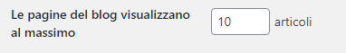

Negli [ultimi tutorial](/argomento/wordpress-dev/) abbiamo iniziato a **creare un tema WordPress da zero**, e siamo arrivati già a un buon punto!

Ci mancano però ancora un paio di cosette per rendere accettabile il nostro lavoro. **Vediamo di andare avanti!**

_Ti ricordo che sul fondo di questo articolo potrai trovare un link al tema completo. Potrai scaricarlo per cercare eventuali errori ed utilizzarlo come vorrai! Consideralo un regalo!_

Ma riprendiamo il **tutorial**!

## Inserire immagini

Con WordPress è semplicissimo inserire immagini all'interno degli articoli, delle pagine o dei widget, ma se volessimo inserire per esempio un logo? Oppure un'immagine in un punto specifico del sito?

Per fare questo dobbiamo utilizzare la funzione _get\_template\_directory\_uri_, che ci permette di **collegarci alla cartella del nostro tema**. Vediamo come fare.

### Inseriamo un logo nella navbar

Per prima cosa rechiamoci nella cartella del nostro tema e creiamo un'altra cartella chiamata "**img**". Qua dentro ora possiamo inserire le immagini che vogliamo inserire nel tema. Inseriamo un logo. Io lo chiamerò "**logo.png**".

Ora andiamo nel nostro _header.php_ e inseriamo il logo prima del titolo del nostro sito, in questo modo:

```
/img/logo.png" alt="" height="50">
```

La funzione _get\_template\_directory\_uri_ inserirà il percorso della cartella del nostro sito, a cui noi aggiungiamo il percorso per raggiungere l'immagine.

Prova a salvare e aggiornare il sito, dovresti vedere **il logo comparire** prima del nome del sito!

Se appare brutto puoi **modificarlo tramite CSS**, ma per il momento ci interessa il fatto che compaia!

La funzione _get\_template\_directory\_uri_ può essere utilizzata ogni volta che dobbiamo raggiungere qualcosa contenuto nella **cartella del nostro tema.**

Potremmo anche utilizzarla per inserire i file CSS e JS nel sito, ma WordPress prevede un sistema diverso, che vedremo fra poco.

## Hook

Nello sviluppo WordPress gli **hook** hanno una grande importanza.

Ci permettono di _aggrapparci_ a questi per inserire le nostre customizzazioni. Questo permette a noi sviluppatori di inserire delle **modifiche al nostro tema** senza toccare il core di WordPress.

Ci sono alcuni hook che sono **fondamentali** in ogni tema ben fatto.

### wp\_title

Un primo hook da inserire è il _wp\_title_, che va messo nel meta tag <title>, nell'<head> della pagina.

Apriamo quindi il nostro _heder.php_ e modifichiamo il <title> in questo modo:

```
<title><?php wp_title(); ?></title>
```

In questo modo il tag del titolo verrà **gestito da WordPress** nel migliore dei modi.

### wp\_head

Sempre nel nostro header dobbiamo aggiungere l'hook _wp\_head_. Questo ci permette di inserire i nostri CSS e JS nell'<head> della pagina, come vedremo fra poco.

Aggiungiamo quindi questo codice giusto prima del _</head>_:

```
<?php wp_head(); ?>
```

### body\_class

Rimaniamo sempre nel nostro header.php e aggiungiamo un hook anche al <body>, in questo modo:

```
<body <?php body_class(); ?>>
```

Così WordPress **gestirà al meglio il body** del nostro tema.

### wp\_footer

L'ultimo hook che andremo ad aggiungere è il _wp\_footer_, che permette di inserire i contenuti prima del _</body>_, come i file javascript.

Andiamo quindi nel _footer.php_ e inseriamo questo giusto prima del </body>

```
<?php wp_footer(); ?>
```

## Inserire CSS e JS in un tema WordPress

Il **metodo corretto** per inserire dei file CSS e JS all'interno di un tema WordPress è un po' particolare.

Sebbene funzioni anche in metodo classico di inserimento nell'<head> e prima del </body> (metodo che abbiamo utilizzato nella parte 1 di questa serie di tutorial), un tema WordPress ben fatto deve inserire i file CSS e JS attraverso il file **_functions.php._**

### CSS

Iniziamo ad aprire il nostro file _functions.php_ e inseriamo questo codice per embeddare il nostro file style.css nel tema:

```
function risorse_il_mio_tema() {
	//CSS
         enqueue_style('style', get_stylesheet_uri());
}
add_action('wp_enqueue_scripts', 'risorse_il_mio_tema');
```

In questo modo embedderemo il file _style.css_, obbligatorio in ogni tema WordPress.

Ora inseriamo il CSS di **[Bootstrap](/guide/le-basi-di-bootstrap/)** in maniera corretta. Lo aggiungiamo a questa funzione, in questo modo:

```
wp_enqueue_style( 'bootstrap','http://stackpath.bootstrapcdn.com/bootstrap/4.3.1/css/bootstrap.min.css','','','all');
```

Ricorda di inserire **Bootstrap** come **primo file**, prima di "style", per un corretto funzionamento.

Ora andiamo nell'header.php e rimuoviavo il CSS di bootstrap, che ora verrà inserito nella maniera corretta tramite functions.php

### JS

Inseriamo ora i file **javascript di Bootstrap** nel modo corretto.

Anche i file Javascript vanno inseriti come i CSS, nella stessa funzione, in questo modo:

```
//JS
wp_enqueue_script( 'jquery-js', 'http://ajax.googleapis.com/ajax/libs/jquery/1.11.3/jquery.min.js', '','' ,true);
wp_enqueue_script( 'bootstrap-js', 'http://maxcdn.bootstrapcdn.com/bootstrap/3.3.5/js/bootstrap.min.js', '','' ,true);
```

Ora possiamo eliminare i file JS di bootstrap dal nostro **footer.php**

Per semplicità ti riscrivo **tutta la funzione** di embeddamento di CSS e JS:

```
/* CSS e JS */
function risorse_il_mio_tema() {
	//CSS
	wp_enqueue_style( 'bootstrap','http://stackpath.bootstrapcdn.com/bootstrap/4.3.1/css/bootstrap.min.css','','','all');
	wp_enqueue_style('style', get_stylesheet_uri());

	//JS
	wp_enqueue_script( 'jquery-js', 'http://ajax.googleapis.com/ajax/libs/jquery/1.11.3/jquery.min.js', '','' ,true);
	wp_enqueue_script( 'bootstrap-js', 'http://maxcdn.bootstrapcdn.com/bootstrap/3.3.5/js/bootstrap.min.js', '','' ,true);

}
add_action('wp_enqueue_scripts', 'risorse_il_mio_tema');
```

**In questo modo hai inserito i codici CSS e JS secondo le Best Practice di WordPress!**

## Paginazione

Se il nostro tema inizierà ad avere molti articoli, allora la pagina archivio diventerà presto molto pesante.

Fortunatamente WordPress fornisce una funzione per facilitare moltissimo la **paginazione**.

Puoi decidere quanti articoli far visualizzare nelle pagine archivio tramite la sezione "**Impostazioni - Lettura**".



Per inserire la paginazione nel frontend andiamo nel nostro _**archive.php**_ e inseriamo questa funzione **dopo il** **loop**:

```
<?php echo paginate_links(); ?>
```

In questo modo **i link di paginazione saranno gestiti interamente da WordPress!**

Fantastico vero? Nulla di più semplice! Non ti resta che rendere questi link un po' più carini, tramite **CSS**.

### Commenti

Il sito inizia ad avere senso, ma non abbiamo ancora inserito una sezione commenti! Vediamo come fare!

Iniziamo creando un file **_comments.php_** nella cartella del nostro tema.

**comments.php**

```

<div id="comments" class="comments-area">

    <?php if ( have_comments() ) : ?>
        <h2 class="comments-title">
            <?php
                printf( _nx( 'Un commento per "%2$s"', '%1$s Commenti su "%2$s"', get_comments_number(), 'comments title', 'beauty-mountain' ),
                    number_format_i18n( get_comments_number() ), '<span>' . get_the_title() . '</span>' );
            ?>
        </h2>

        <ol class="comment-list">
            <?php
                wp_list_comments( array(
                    'style'       => 'ol',
                    'short_ping'  => true,
                    'avatar_size' => 74,
                ) );
            ?>
        </ol><!-- .comment-list -->

        <?php
            // Ci sono più commenti?
            if ( get_comment_pages_count() > 1 && get_option( 'page_comments' ) ) :
        ?>
        <nav class="navigation comment-navigation" role="navigation">
            <h1 class="screen-reader-text section-heading"><?php _e( 'Comment navigation', 'beauty-mountain' ); ?></h1>
            <div class="nav-previous"><?php previous_comments_link( __( '&larr; Older Comments', 'beauty-mountain' ) ); ?></div>
            <div class="nav-next"><?php next_comments_link( __( 'Newer Comments &rarr;', 'beauty-mountain' ) ); ?></div>
        </nav><!-- .comment-navigation -->
        <?php endif; ?>

        <?php if ( ! comments_open() && get_comments_number() ) : ?>
        <p class="no-comments"><?php _e( 'Comments are closed.' , 'beauty-mountain' ); ?></p>
        <?php endif; ?>

    <?php endif; // have_comments() ?>

    <?php comment_form(); ?>

</div><!-- #comments -->
```

Questo codice ti pemetterà di inserire i commenti, ora andiamo nel file **_single.php,_** quello che contiene i nostri articoli, e inseriamo il template per i commenti dopo il contenuto:

```
<!-- COMMENTI -->
<?php comments_template(); ?>
```

In questo modo potrai **vedere i commenti sui tuoi articoli!**

**Perfetto!** Direi che per iniziare abbiamo già creato qualcosa di carino!

Prima di lasciarti andare via ti condivido ancora **un po' di CSS** per rendere il nostro lavoro un po' più carino.

Ricorda che puoi **scaricare l'intero tema**, per controllare errori e verificare di aver capito tutto al meglio! Clicca **sul bottone sul fondo** dell'articolo per scaricare il tema!

Non è un tema perfetto ma può essere un buon **starter theme** per i tuoi progetti futuri!

**style.css**

```
/*
Theme Name: Il mio tema
Author: Specialista WP
Description: Il mio primo tema WordPress
Version: 0.0.1
*/

/*
 * Globals
 */

a:hover{
  text-decoration: none;
}

img{
  max-width: 100%;
  height:auto
}

footer{
  background-color: #888;
  margin-top: 50px;
  padding-top: 50px;
  color:#000;
  margin-bottom: 0;
  padding-bottom: 50px;
}

```

_[<< Parte 2](/guide/le-basi-dellhtml/)_

_[Creare Plugin >>](/guide/creare-un-plugin-wordpress/)_
