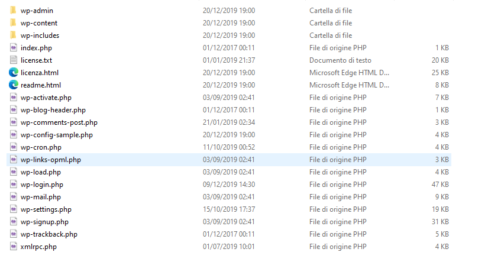
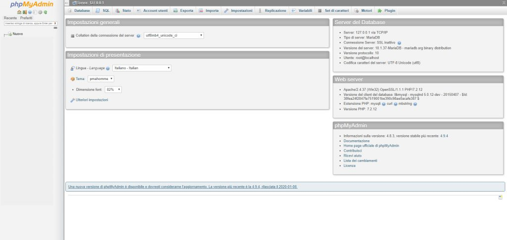
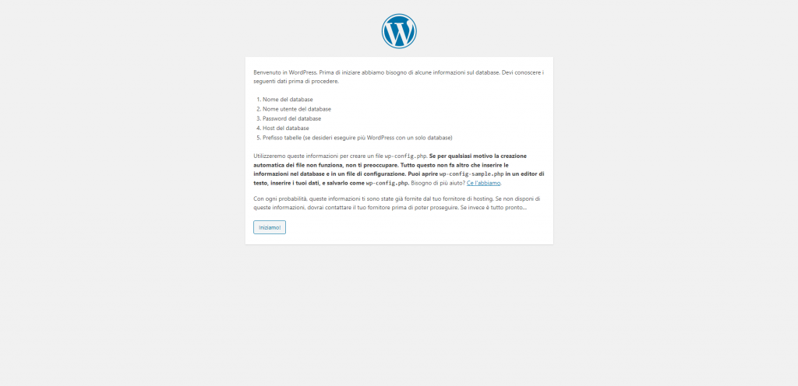
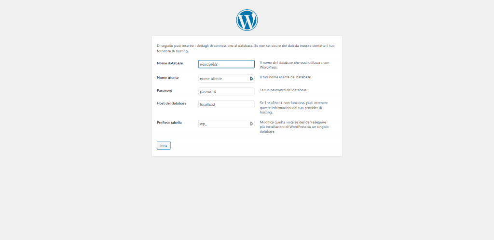
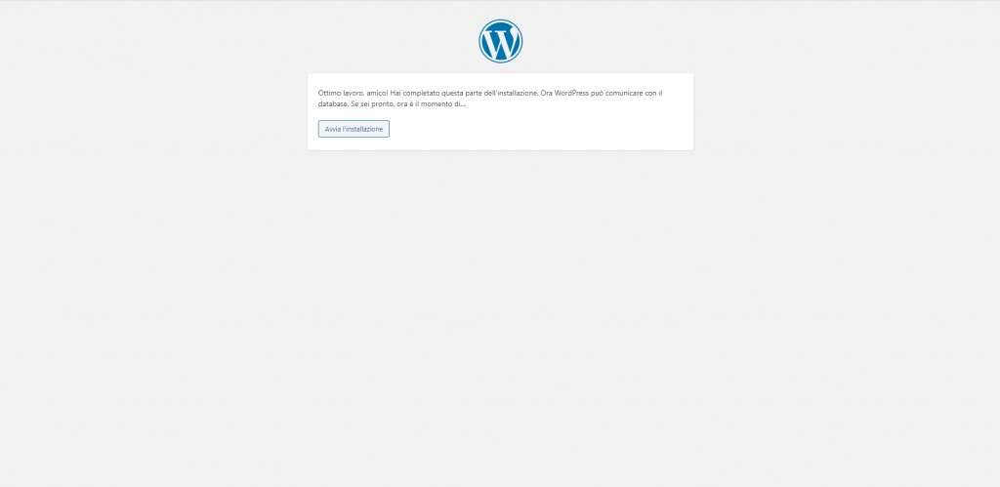
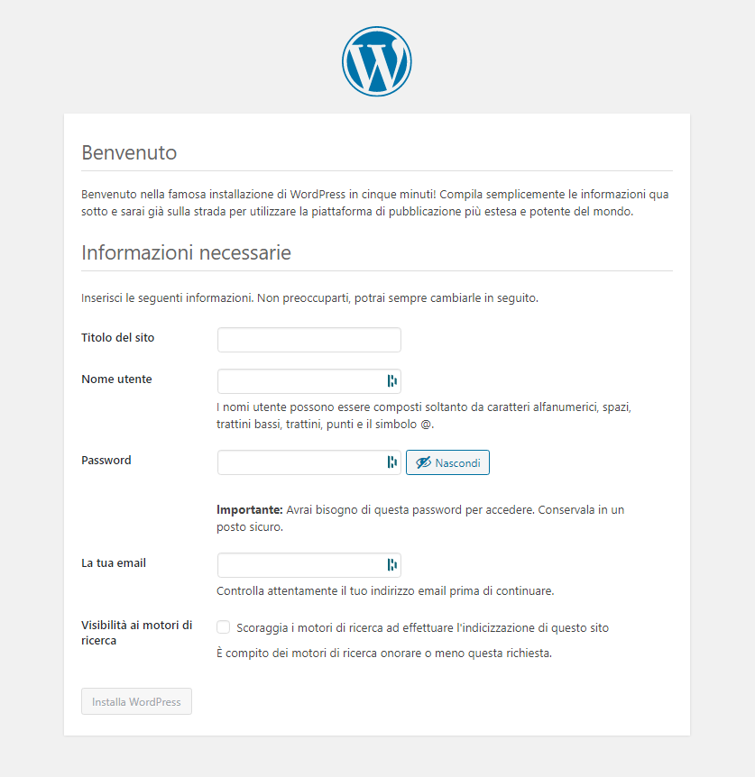
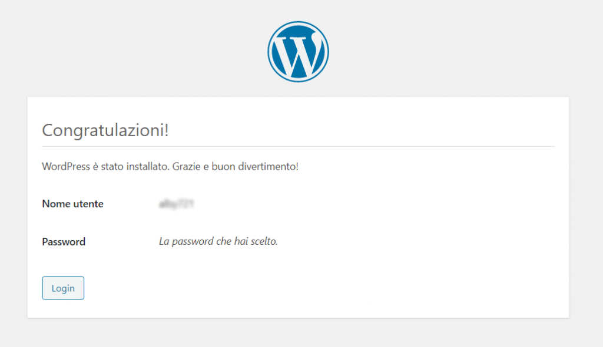
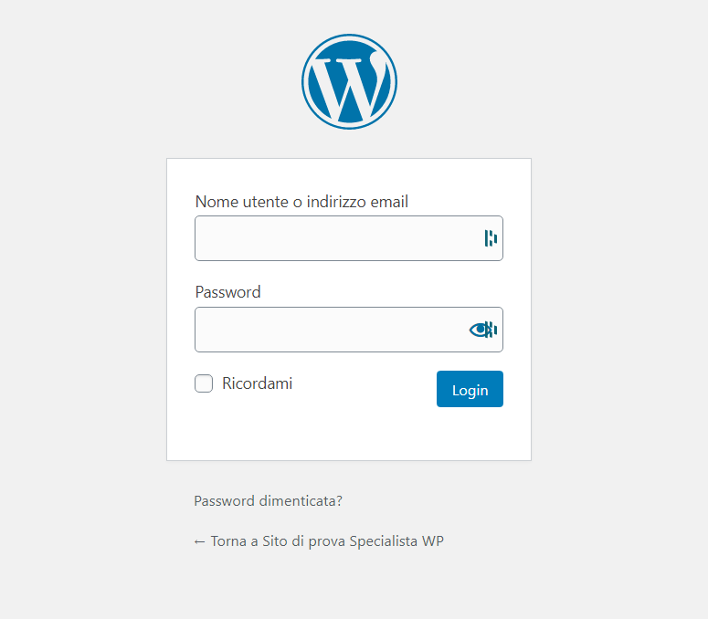
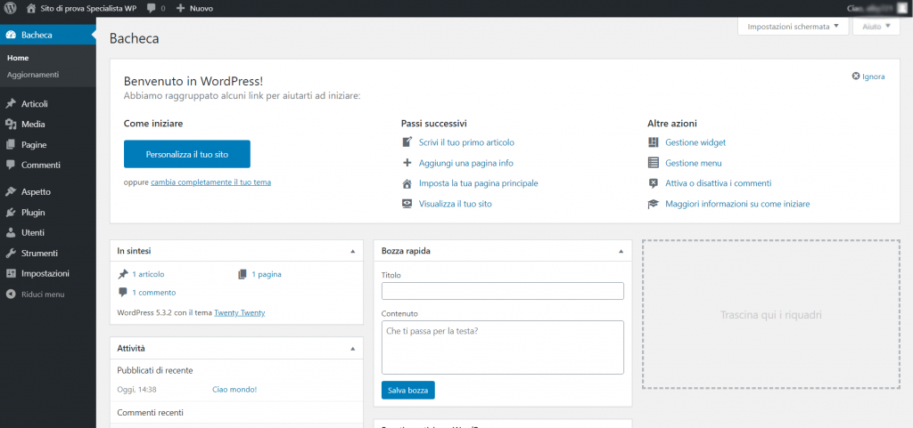

Se vuoi diventare uno **sviluppatore WordPress** allora dovrai installare il fantastico CMS in **locale**. Non preoccuparti se non sai bene cosa vuol dire, questo articolo è rivolto ai **principianti**, perciò andrò ad affrontare l’argomento **passo passo** spiegandoti tutto nei dettagli.

Perciò mettiti seduto e concentrato e **iniziamo ad imparare!**

## PERCHÉ IN LOCALE?

Molte guide o tutorial mostrano come **installare WordPress direttamente online**, spesso utilizzando i servizi che le aziende di hosting mettono a disposizione per installare il CMS automaticamente.

Questo può esssere molto utile ad un utente che non sa nulla di programmazione e vuole provare a crearsi il proprio sito da solo.

Vogliamo **capire quel che facciamo**, diventare **bravi sviluppatori WordPress** e creare siti web e web app **meravigliosi**!

Perciò faremo la strada più lunga (non poi tanto in realtà) ed impareremo veramente tutto su WordPress **a partire da ZERO!**

* * *

Per capire meglio ciò che andremo a fare ora ti **consiglio** di leggere questi articoli:

- [Configurare il PC per Sviluppare in WordPress](/guide/configurare-il-pc-per-sviluppare-in-wordpress%ef%bf%bc/)
- [Perché intallare WordPress in locale?](/guide/perche-installare-wordpress-in-locale/)
- [Come funziona XAMPP](/guide/come-funziona-xampp/)

* * *

## 1\. SCARICARE WORDPRESS

Per prima cosa è necessario **scaricare WordPress.**

Farlo è molto semplice, è sufficiente andare a questo **link**: [http://it.wordpress.org/](http://it.wordpress.org/) e premere il bottone “**Scarica WordPress**” in alto a destra.

Ora non resta che aspettare il termine del **download**, di solito è abbastanza rapido ma i tempi potrebbero cambiare a seconda della velocità della tua connessione.

## ESTRARRE WORDPRESS

Il file scaricato è in formato **.zip**, perciò occorre **estrarlo**.

Basta fare **click** con il tasto **destro** sul file e premere “**estrai qui**“.

Terminata l’estrazione avrai una cartella chiamata “**wordpress**“.

## AVVIARE XAMPP

Per poter far funzionare il nostro sito in WordPress in locale dobbiamo far partire il **XAMPP**.

Per **avviare XAMPP** ti basterà cliccare sulla sua icona e una volta aperto il software cliccare su “**Start**” in corrispondenza di **Apache** e **MySQL**.

In questo modo avvierai il server locale ed il database!

Ora sei pronto a caricare WordPress sul server.

## CARICARE WORDPRESS NEL SERVER LOCALE

Aprendo questa cartella dovresti trovare al suo interno **3 cartelle:**

- wp-admin
- wp-content
- wp-includes

**più una serie di file.**

**Questo è WordPress!!!**

Ora torna indietro di un livello e **segui questi passaggi:**

- Copia la cartella “wordpress”.
- Vai nella cartella **htdocs** (C:\\xampp\\htdocs in Windows) e incolla qui.
- Rinomina “wordpress” con “wp-test”

Hai appena inserito il sito “wp-test” sul tuo **server locale!**

Ora vediamo come creare un database **MySQL** per il tuo sito.

## CREARE IL DATABASE

**WordPress** per poter funzionare **ha bisogno di un database.**

Andremo quindi ora a **crearlo** utilizzando **phpmyadmin**.

**Accedere** a phpmyadmin è molto **semplice**, ti basterà scrivere “**localhost/phpmyadmin**” nella barra di ricerca del tuo browser.

Ti ritroverai in una schermata come questa:

Questo è il programma attraverso il quale **gestiremo i nostri database.** Graficamente non è carinissimo ma è molto **potente** e funzionale.

Per il momento devi solamente **cliccare su “Nuovo”** nella barra laterale sinistra.

Sulla destra vedrai una schermata come questa qua sopra, ti basterà **scrivere il nome del database**, in questo caso “wp-test” e cliccare “**Crea**“

Dovresti vedere comparire un database chiamato “wp-test” nella sidebar a sinistra.

**Complimenti!!!** Hai appena creato il database per il tuo sito WordPress!

## INSTALLARE WORDPRESS!

**Finalmente** è arrivato il momento di installare **WordPress**.

Per prima cosa colleghiamoci al nostro sito sul server locale, a questo indirizzo: http://wp.local-test

Nel corso degli anni la procedura di installazione del CMS si è perfezionata sempre di più e oggi è possibile portarla a termine con **pochi semplici passaggi**:

### PASSAGGIO 1:

Clicchiamo sul pulsante “**Iniziamo!**“

### PASSAGGIO 2:

A questo punto ci vengono chiesti dei **parametri di configurazione**. Non preoccuparti, ora ti spiegherò cosa significano:

- **Nome database:** è il nome che abbiamo dato prima al database creato con phpmyadmin, in questo caso “_wp-test_“.
- **Nome utente:** è il nome utente del database. **ATTENZIONE!!!** Non è il tuo nome utente, ma quello per poter accedere al database. XAMPP crea in automatico un nome utente per il database che è “_root_“.
- **Password:** anche qua è la password del database. Di default XAMPP non inserisce nessuna password. Essendo in locale non c’è bisogno di questo livello di sicurezza. Quando andremo a creare un sito WordPress online la password del database sarà fondamentale.
- **Host del database:** dove è “_hostato_” il database. In questo caso “_localhost_“, cioè sul nostro server locale.
- **Prefisso tabella:** WordPress assegna un prefisso ad ogni tabella che crea. Per il momento puoi lasciare “_wp\__“.

**In sintesi puoi compilare questo passaggio così:**

- Nome database: wp-test
- Nome utente: root
- Password:
- Host del database: localhost
- Prefisso tabella: “wp\_”

### PASSAGGIO 3:

Molto bene! Il difficile è fatto! **Da ora è tutto in discesa.**

WordPress si congratula con noi per aver inserito correttamente i dati del passaggio precedente, quindi non ci resta che cliccare su “**Avvia installazione**“

### PASSAGGIO 4:

Ora WordPress è stato installato! Non ci resta che **configurare** un paio di cosette:

- **Titolo del sito:** sarà il titolo del nostro sito web, in questo caso puoi mettere “Sito di prova WP”
- **Nome utente:** questo è il tuo nome utente con il quale accederai al backend del sito. Metti pure ciò che vuoi. Ti consiglio di non utilizzare nomi facilmente indovinabili come “admin”, è meglio un nome come “pippo8756”.
- **Password:** la password con la quale accederai al backend.
- **La tua email:** il tuo indirizzo email che sarà collegato al tuo account. ATTENZIONE! Essendo installato in locale WordPress non potrà inviare email, lo può fare solamente se installato online.
- **Visibilità ai motori di ricerca:** tramite questa checkbox puoi dire a WordPress di escludere il tuo sito dalla ricerca dei motori di ricerca. Raramente dovrai cliccare questo campo.

Compilati i campi puoi cliccare su “**Installa WordPress**“

### PASSAGGIO 5:

**E VOILÀ!!!**

Hai appena terminato di installare correttamente WordPress in locale sul tuo computer!

Ora puoi cliccare su “**Login**“

Inserire i tuoi dati di accesso ed **entrare nella tua installazione di WordPress.**

Questo è il **backend** di WordPress:

Da qui potrai **configurare** e **compilare** il tuo sito web.

Cliccando sull’icona della casetta in alto a destra invece potrai vedere il front-end del tuo sito

Durante l’installazione WordPress inserisce il suo tema standard. Quindi per il momento vedrai un **front-end** come questo:

**CONGRATULAZIONI!!!**

Hai appena installato **WordPress in locale** sul tuo computer!

Hai fatto il primo passo per iniziare a diventare uno sviluppatore WP. Continua a leggere i nostri articoli per migliorare sempre di più e diventare un vero PRO!
