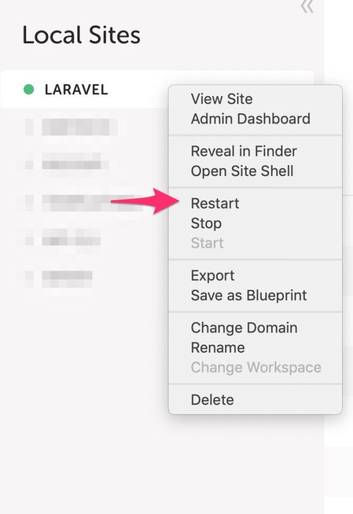

Sebbene Local by Flywheel sia stato pensato principalmente per utilizzare WordPress in locale può funzionare molto bene anche con Laravel o progetti in Core PHP e MySQL.

Local è molto semplice da utilizzare, veloce e ben organizzato, perciò è la mia scelta di default fra i server locali.

Vediamo ora come installare Laravel in locale su Local by Flywheel.



_Nota: cercherò di aggiornare questo articolo con le ultime versioni di Laravel. (ultimo aggiornamento: 18 febbraio 2020)_

## Aggiungere il sito in locale

Innanzitutto bisogna aggiunge un sito normalemente su Local:

1. Fare clic sul grande pulsante “+”
2. Assegnare un nome al sito (diciamo “Laravel”)
3. Selezionare l’ambiente che desideri (il nginx predefinito funzionerà perfettamente con Laravel)
4.  Inserisci il tuo nome utente e password WP (questi verranno eliminati a breve)
5. Fare clic su aggiungi sito.

Puoi anche aggiungere rapidamente un certificato SSL, se lo desideri. Ti consiglio di farlo, poiché tutti i siti Web e le app saranno protetti quando vengono avviati in produzione, in questo modo avrai un ambiente molto simile a quello online.

## Installa Laravel e un nuovo progetto Laravel

Ora vediamo come installare Laravel in locale su Local by Flywheel.

Questo passaggio richiede che Composer sia installato globalmente sul tuo sistema. Puoi trovare le istruzioni per questo passaggio [**qui**](https://getcomposer.org/doc/00-intro.md#installation-linux-unix-macos) . 

Una volta installato Composer, puoi seguire le istruzioni di installazione per installare anche Laravel a livello globale. Puoi trovare la documentazione **[qui](https://laravel.com/docs/5.7/installation)** , ma il comando di base sarà: 

```
composer global require laravel/installer
```

Una volta installato Larvel a livello globale, installiamolo nella nostra App in locale su Local:

- Apri “Site Shell”: fai click con il tasto destro sul sito “Laravel” e clicca su “Open site shell”.
- In Site Shell Terminal, passa alla directory “Laravel” che hai appena creato ( `cd ../..` , dobbiamo andare indietro di due livelli).
- Elimina la cartella “app” corrente (nella finestra Finder / Explorer o tramite riga di comando)
- Quindi esegui il seguente comando dalla nuova directory del sito:

```
laravel new app
```

Se questo comando vi dà “_zsh: command not found: laravel_” allora provate a dare questo da terminare:

```
export PATH="$HOME/.composer/vendor/bin:$PATH"
```

Questo creerà un nuovo progetto Laravel all’interno della directory “app” e includerà la cartella “public”, utilizzata da Local di default.

A questo punto, dovresti essere in grado di fare clic su “Visualizza sito” nell’app locale e dovrebbe mostrarti la pagina di benvenuto di Laravel, su htts: //laravel.local, per esempio. Se ricevi un errore 502, 404 o qualche altro errore, potrebbe essere necessario riavviare il server:



## Collegamento del database

Nel tuo `.env`file, puoi sostituire le seguenti credenziali (supponendo che tu non abbia modificato le impostazioni predefinite Local by Flywheel):

```
DB_CONNECTION=mysql
DB_HOST=localhost
DB_PORT=3306
DB_SOCKET="/Users/yourusername/Library/Application Support/Local/run/lkIEkdiowIEkmd/mysql/mysqld.sock"
DB_DATABASE=local
DB_USERNAME=root
DB_PASSWORD=root
```

Il DB\_SOCKET lo trovare nella scheda “Database” di Laravel.

Quanto sopra si collegherà al DB locale. Se apri il tuo database utilizzando Adminer, puoi entrare ed eliminare le tabelle di wordpress, quelle che cominciano con “wp\_”. 

Infine, puoi controllare il collegamento fra Laravel e il DB con questo:

```
php artisan migrate
```

Dopo aver eseguito il comando precedente, è possibile aggiornare Adminer e visualizzare il database con seed predefinito.

E voilà! Questo è tutto. In poco tempo abbiamo creato un’istanza Laravel pronta a funzionare!

Buon codice!
