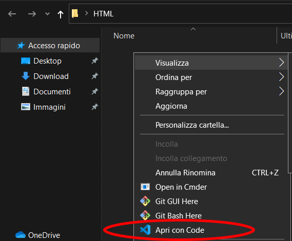
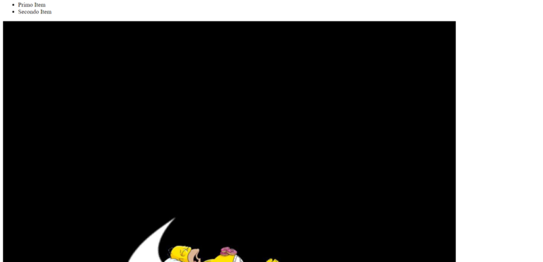
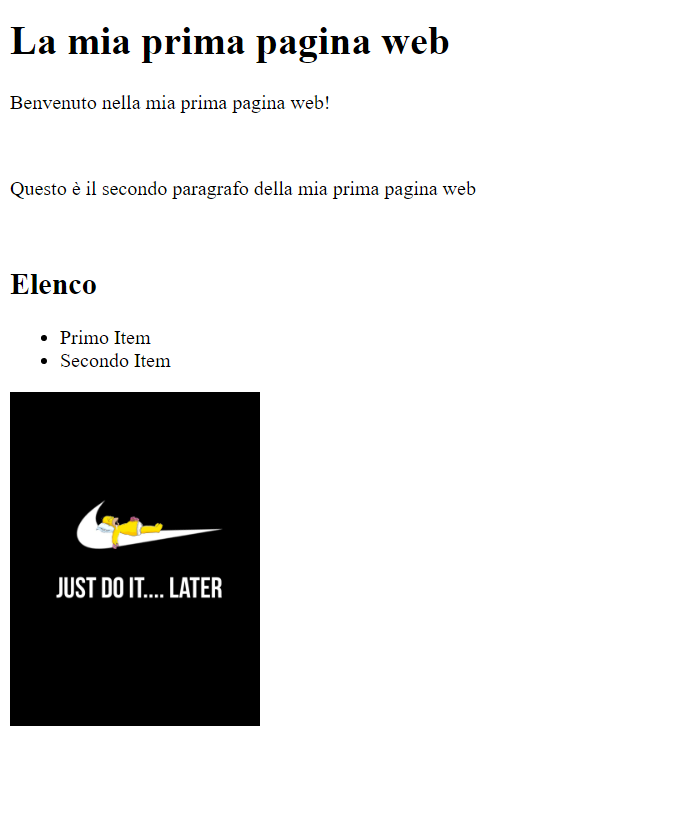

**L’HTML è la base del web**, c’è dappertutto! Ogni pagina internet che visualizzi ha del codice HTML al suo interno. Se vuoi diventare uno sviluppatore web quindi la prima cosa da fare è un corso intensivo di HTML!

* * *

_Questo corso è rivolto ai **principianti**, pertanto se conosci già l’HTML questo articolo non fa per te, se invece sei agli inizi **BENVENUTO** e buono studio! Vedrai che **imparerai presto** a cerare fantastici contenuti web!_

* * *

L’HTML non è proprio un linguaggio di programmazione, ma è un **linguaggio di markup,** infatti HTML è l’acronimo di _HyperText Markup Language_.

Ciò significa che l’HTML non fa operazioni di calcolo, ma sostanzialmente indica al browser **come _montare_ la pagina**, cosa posizionare e come posizionarlo.

## Cosa serve per iniziare

Per iniziare a scrivere codice HTML **non servono super computer** nè programmi pesanti e costosi.

Se vuoi iniziare a sviluppare contenuti per il web inizialmente **ti bastano 2 cose:**

- web browser
- editor di testo

### Web Browser

Sviluppando qualcosa che sarà fruibile attraverso un browser, **il browser è fondamentale**. Ne esistono veramente molti e tutti validi, ma il mio consiglio è di utilizzare **[Google Chrome](https://www.google.com/intl/it_it/chrome/)**.

Se non sei un fan del browser di google eccoti alcune alternative:

- [Microsoft Edge](https://www.microsoft.com/it-it/edge) (Windows)
- [Safari](https://www.apple.com/it/safari/) (Mac)
- [Mozilla Firefox](https://www.mozilla.org/it/firefox/new/)

### Editor di testo

L’altro software **fondamentale** per sviluppare per il web è un editor di testo.

Un editor di testo è un programma che **consente di scrivere il codice.** Si potrebbe utilizzare banalmente il classico editor di testo del sistema operativo (Blocco note o Text edit), ma fortunatamente esistono software dedicati allo sviluppo che rendono la scrittura del codice molto più semplice.

Il mio consiglio è di utilizzare **[VS Code](https://code.visualstudio.com/)**, a mio avviso in questo momento è il migliore in assoluto.

Anche qui hai comunque molta scelta! Ecco alcune delle migliori **alternative** a VS Code:

- [Sublime Text](https://www.sublimetext.com/)
- [Atom](https://atom.io/)
- [Brackets](http://brackets.io/)
- [Notepad++](https://notepad-plus-plus.org/downloads/)

## Creiamo il nostro primo file HTML

Ora che hai scaricato un browser e un editor di testo, possiamo crerare il nostro primo file HTML.

Creiamo una **cartella** sul desktop chiamata “**HTML**“. Ora apriamo questa cartella con **VS Code**, facendo click con il tasto destro del mouse all’interno della cartella e cliccando “**Apri con Code**“



Ora possiamo creare il nostro file con VS Code.

Clicchiamo “**CTRL+N**” per creare un nuovo file e poi “**CTRL+S**” per salvarlo, con il nome “**_index.html_**“.

Tutti i file HTML devono avere estensione .html, cioè finire con .html, questo farà capire al browser il tipo di file che sta leggendo.

Puoi creare i file anche tramite il menù in alto, cliccando su “File-New File” oppure con l’icona specifica nella barra laterale sulla sinistra.

**PERFETTO! Abbiamo creato il nostro primo file HTML!**

## Struttura base

Ogni pagina HTML è diversa, ma tutte hanno una **struttura base comune**, uno _**scheletro**_ sul quale sono costruite.

_VS Code_ ci permette di creare questo scheletro in maniera **semplicissima e molto veloce.**

Ci basterà aprire il file, inserire un **punto esclamativo** e cliccare il tasto “**tab**“. In questo modo VS Code creerà la struttura base della nostra pagina HTML in automatico.

Se hai fatto questa operazione dovresti vedere comparire questo codice all’interno del file:

```
<!DOCTYPE html>
<html lang="en">
<head>
    <meta charset="UTF-8">
    <meta name="viewport" content="width=device-width, initial-scale=1.0">
    <title>Document</title>
</head>
<body>

</body>
</html>
```

Questo è lo _**scheletro**_ di ogni pagina HTML. Andiamo ad analizzarlo!

## I tag HTML

L’HTML è un linguaggio basato sui **tag**.

Ogni tag indica una **tipologia di contenuto.**

**Struttura base**: <nometag>contenuto</nometag>

Qualsiasi contenuto è sempre inserito all’interno di un **tag**, che **indica al browser come trattare quel tipo di contenuto**.

Generalmente i tag hanno un inizio e una fine, il tag di fine inizia con uno slash(/).

Esistono però alcuni tag senza tag di chiusura, come il tag <br>, che è utilizzato per andare a capo.

## Esempi di tag:

```
<html></html>
```

Questi tag indicano dove inizia e dove finisce la pagina HTML. Tutto il contenuto va inserito fra questi due!

```
<head></head>
```

Questo tag permette di inserire delle informazioni relative alla pagina, come il titolo, gli stili da inserire, gli script etc. (Questo ti sarà più chiaro man mano che andrai avanti)

```
<body></body>
```

All’interno di questi tag c’è il vero e proprio contenuto della pagina

```
<h1>La mia prima pagina web</h1>
```

I titoli sono inseriti dentro i tag heading, che vanno dall’1 al 6, in ordine di importanza. Il titolo della pagina deve essere inserito fra i tag <h1></h1>, il sottotitolo <h2></h2> e così via.

```
<br>
```

Questo tag indica al browser di andare a capo.

```
<!-- Questo è un commento -->
```

In qualiasi tipo di codice è molto importante inserire i commenti. Questi permettono di inserire delle note all’interno del codice, per poter capire meglio cosa si sta scrivendo o per inserire delle frasi rivolte ai colleghi etc.

```
<ul>

    <li>Questo è un item di un elenco</li>

    <li>Questo è un altro item</li>

</ul>
```

Il tag <ul> permette di inserire un elenco. Per inserire un elenco numerato c’è il tag <ol> (Unordered List e Ordered List).

Ogni elemento di un elenco deve essere inserito con il tag <li> (List Item)

## Sporchiamoci le mani

Iniziamo ora a **modificare lo** **_scheletro_** della nostra pagina HTML.

Iniziamo a modificare la **lingua**, modificando “en” con “it” nella **riga 2** del nostro file.

La riga 2 sarà quindi così:

```
<html lang="en">
```

Ora andiamo sulla riga 6 e modifichiamo il titolo, nel tag **_<title>_**.

Chiamiamo questa pagina “**La mia prima pagina web**“

```
<title>La mia prima pagina web</title>
```

Ora salviamo il file e apriamolo, semplicemente aprendo la cartella “**HTML**” e facendoci **doppio click** sopra.


Ci troveremo di fonte una **pagina completamente bianca**, perché non abbiamo ancora inserito nessun codice nel contenuto.

Possiamo vedere però che il nome della scheda in alto è “**La mia prima pagina web**“. Questo è il **_<title>_** della nostra pagina.

**Ora inseriamo un po’ di contenuto.**

Andiamo **fra i tag <body></body>** e inseriamo questo:

```
   <h1>La mia prima pagina web</h1>
    <p>Benvenuto nella mia prima pagina web!</p>
    <br><!-- questo è un a capo-->
    <p>Questo è il secondo paragrafo della mia prima pagina web</p>
    <br>
    <h2>Elenco</h2>
    <ul>
        <li>Primo Item</li>
        <li>Secondo Item</li>
    </ul>
```

Ora **salva la pagina e aggiornala nel browser**, vedrai comparire del contenuto!


Non è difficile da capire, ogni tag spiega se stesso.

**CONGRATULAZIONI!**

**Hai appena creato la tua prima pagina web!**

Ma addentriamoci ancora un po’ nell’HTML.

## Inseriamo un’immagine

Per inserire un’immagine in una pagina HTML bisogna utilizzare il tag ****, con alcuni attributi.

Gli **attributi** forniscono **informazioni aggiuntive** ai tag html. Per esempio il tag  indicherà al browser di inserire un’immagine, ma quale immagine? A questa domanda rispondiamo con l’attributo “**src**“, cioè la sorgente da cui il browser può attingere per inserire l’immagine.

Esempio:

```

```

In questo esempio il browser inserirà l’immagine **foto.jpg** presente nella cartella “**immagini**“.

Proviamo ora ad inserire un’immagine nella nostra pagina.

Andiamo nella nostra cartella “**HTML**” sul desktop e creiamo una cartella chiamata “**img**“, all’interno di questa cartella inseriamo ora una qualsiasi immagine in formato **JPG**.

Adesso **richiamiamo l’immagine nel nostro file _index.html_,** in questo modo:

```

```

Ora **salviamo** il file e **aggiorniamo** il browser.



Vediamo che l’immagine viene visualizzata nella nostra pagina html.

Però è un po’ **troppo grande!** Almeno nel mio caso, questo dipende dalle dimensioni dell’immagine.

Per visualizzare l’immagine in modo più carino possiamo aggiungere un altro attributo al nostro tag : **l’attributo height o width**

```
    
```

In questo modo sto **impostando la larghezza dell’immagine a 200px.** Ed ecco che si vede tutto decisamente meglio.



In questo modo posso **ridimensionare** l’immagine.

Ora **andiamo ancora più a fondo** nell’html.

## I contenitori

Nelle nostre pagine html possiamo inserire dei **contenitori**, nei quali inserire del contenuto. Questi sono molto utili per **suddividere le pagine e gestire i contenuti al meglio.**

### <div>

Un primo tipo di contenitore è il tag **<div>**. Questo crea una **sezione** nella pagina. È un **block element**, cioè il contenuto dopo questo tag è inserito **a capo**.

### <span>

Lo **<span>** è un contenitore ma **inline**, cioè **non va a capo** dopo di esso.

Se voglio creare un quadrato verde nel sito dovrò utilizzare un <div>, se invece voglio colorare una parola di rosso allora userò il tag <span>.

**Eccoti un esempio:**

Aggiungi questo codice a _**index.html**_

```
    <div style="background-color: green;">
        Questo è un contenitore con sfondo verde
    </div>
    <p>
        Questo è un paragrafo con del testo inserito a caso. In questo testo voglio <span style="color:red">colorare</span> una parola di rosso
    </p>
```

ed ecco il **risultato**


Per inserire i colori ho utilizzato l’attributo “style”, che permette di inserire del codice CSS all’interno dell’HTML, ma lo vedremo meglio nella [guida](/guide/le-basi-del-css/) [al CSS.](/corso-intensivo-di-css/)

## I form

Un altro elemento molto importante di una pagina web è il **form**.

Navigando online avrai compilato moltissime volte dei **moduli**, che siano di contatto, di prenotazione etc.

Per inserire un form occorre utilizzare il tag **<form></form>** e al suo interno inserire **le tipologia di input** richieste.

**Esempio** di form:

```
  <form>
        <input type="text" placeholder="Nome">
        <br><br>
        <input type="text" placeholder="Cognome">
        <br><br>
        <select name="select" id="">
            <option value="0">Opzione 1</option>
            <option value="1">Opzione 2</option>
            <option value="2">Opzione 3</option>
        </select>
        <br><br>
        <textarea name="" id="" cols="30" rows="10" placeholder="Inserisci il testo qui."></textarea>
        <br><br>
        <input type="checkbox" name="privacy" value="0">Accetto la Privacy Policy
        <br><br>
        <button>Invia</button>
    </form>
```

Prova a inserire questo codice in **_index.html_**, salvare e aggiornare.

Vedrai comparire dei campi compilabili.

**Questi campi sono**

- input di tipo text nel caso del nome e del cognome.
- select nel caso del menù a tendina
- textarea nel caso dell’area di testo
- input di tipo checkbox per accettare la privacy
- button per il bottone di invio

Premendo sul tasto “**Invia**” non succederà nulla. Per far svolgere un’azione alla nostra pagina html occorre integrarla con altri linguaggi. Ricordi che **l’HTML è solamente un linguaggio di markup**, non di programmazione.

Per questa guida è tutto. Ti lascio ancora **il codice per intero della nostra _index.html_** con i **commenti** che spiegano cosa fa ogni cosa.

```
<!DOCTYPE html>
<html lang="en">

<head>
    <meta charset="UTF-8">
    <meta name="viewport" content="width=device-width, initial-scale=1.0">
    <title>La mia prima pagina web</title><!-- Il titolo della pagina che appare nella scheda del browser -->
</head>

<body>
    <!-- Titolo -->
    <h1>La mia prima pagina web</h1>
    <!-- Paragrafo -->
    <p>Benvenuto nella mia prima pagina web!</p>

    <br><!-- questo è un a capo-->

    <!-- Sottotitolo -->
    <h2>Sottotitolo</h2>

    <p>Questo è il secondo paragrafo della mia prima pagina web</p>

    <br>

    <h2>Elenco</h2>
    <!-- Elenco -->
    <ul>
        <li>Primo Item</li><!-- Item di un elenco -->
        <li>Secondo Item</li>
    </ul>

    <!-- Immagine -->
    

    <!-- DIV: block element -->
    <div style="background-color: green;">
        Questo è un contenitore con sfondo verde
    </div>

    <!-- SPAN: inline element -->
    <p>
        Questo è un paragrafo con del testo inserito a caso. In questo testo voglio
        <span style="color:red">colorare</span> una parola di rosso
    </p>

    <!-- FORM -->
    <form>
        <!-- Casella di testo -->
        <input type="text" placeholder="Nome">
        <br><br>
        <input type="text" placeholder="Cognome">
        <br><br>
        <!-- Menù a tendina -->
        <select name="select" id="">
            <option value="0">Opzione 1</option>
            <option value="1">Opzione 2</option>
            <option value="2">Opzione 3</option>
        </select>
        <br><br>
        <!-- Area di testo -->
        <textarea name="" id="" cols="30" rows="10" placeholder="Inserisci il testo qui."></textarea>
        <br><br>
        <!-- Checkbox-->
        <input type="checkbox" name="privacy" value="0">Accetto la Privacy Policy
        <br><br>
        <!-- Bottone -->
        <button>Invia</button>
    </form>
</body>

</html>
```

**Ora puoi iniziare a smanettare un po’ con i tag** che hai imparato, provando a **creare e modificare qualche pagina HTML!**

Leggi anche _[Le basi del CSS >>](/guide/le-basi-del-css/)_
