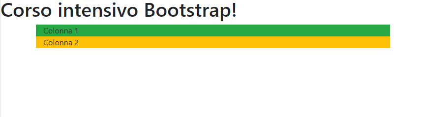
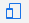
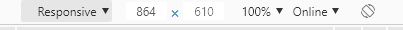
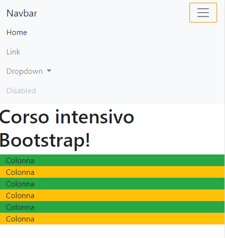
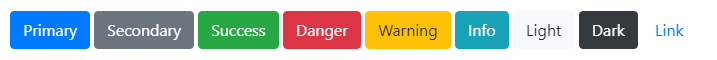

_Questa guida fa riferimento a Bootstrap 4, ora è uscita la versione 5... Appena avrò un attimo di tempo la aggiornerò!_

* * *

Se vuoi diventare uno **sviluppatore web** oggi non puoi fare a meno che scontrarti con **bootstrap**.

Come dice il [sito web uffiliale](https://getbootstrap.com/), **Bootstrap è il framework HTML, CSS e JS più popolare al mondo!**

Una vastissima parte dei layout web sono create attraverso **Bootstrap**, perché rende lo sviluppo responsive **semplice e veloce.**

Sebbene esisteno anche altre alternative, Bootstrap rimane un fondamento nei **layout del web**.

## Cos’è Bootstrap

Ma che cos’è praticamente **Bootstrap**?

Bootstrap è un insieme di **librerie css e js** che velocizzano la realizzazione dei layout delle pagine web.

È stato sviluppato da **Twitter** ed è un progetto **open source.**

## Come includere Bootstrap

Per poter utilizzare Bootstrap occorre includerlo nel progetto, **inserendo** le librerie css e js nella pagina web.

Questo può essere fatto in **2 modi:**

- Tramite CDN
- Scaricando i file

### CDN

Questo metodo consiste nel **richiamare Bootstrap dalla CDN**. È facile e veloce, non occorre scaricare nulla, basta inserire questo codice nell’**_<head>_**:

```
<link rel="stylesheet" href="https://stackpath.bootstrapcdn.com/bootstrap/4.3.1/css/bootstrap.min.css" integrity="sha384-ggOyR0iXCbMQv3Xipma34MD+dH/1fQ784/j6cY/iJTQUOhcWr7x9JvoRxT2MZw1T" crossorigin="anonymous">
```

e questo prima della fine del **_<body>_**:

```
<script src="https://code.jquery.com/jquery-3.3.1.slim.min.js" integrity="sha384-q8i/X+965DzO0rT7abK41JStQIAqVgRVzpbzo5smXKp4YfRvH+8abtTE1Pi6jizo" crossorigin="anonymous"></script>
<script src="https://cdnjs.cloudflare.com/ajax/libs/popper.js/1.14.7/umd/popper.min.js" integrity="sha384-UO2eT0CpHqdSJQ6hJty5KVphtPhzWj9WO1clHTMGa3JDZwrnQq4sF86dIHNDz0W1" crossorigin="anonymous"></script>
<script src="https://stackpath.bootstrapcdn.com/bootstrap/4.3.1/js/bootstrap.min.js" integrity="sha384-JjSmVgyd0p3pXB1rRibZUAYoIIy6OrQ6VrjIEaFf/nJGzIxFDsf4x0xIM+B07jRM" crossorigin="anonymous"></script>
```

**_E voilà!_** Bootstrap è inserito sul sito ed è pronto a funzionare!

### Scaricando i file

Questo metodo consiste nello **scaricare i file di bootstrap**, inserirli nella cartella del sito web e **richiamarli**.

I file di Bootstrap sono **scaricabili** a questa pagina:

[https://getbootstrap.com/docs/4.0/getting-started/download/](https://getbootstrap.com/docs/4.0/getting-started/download/)

Una volta scaricati occorrerà inserire il file **css nell'<head>** e il **js prima del </body>.**

Nel download saranno presenti **molte versioni** dei file, a noi interessano quelli minizzati:

- bootstrap.min.css
- bootstrap.min.js

Inseriamo quindi questo codice nell’_**<head>**_:

```
<link rel="stylesheet" href="css/bootstrap.min.css">
```

E questo prima del **_</body>_**:

```
<script src="js/bootstrap.min.css"></script>
```

Proseguendo **utilizzeremo il metodo CDN**, per semplicità e velocità di configurazione.

**Ecco il template di base da cui partiremo:**

```
<!doctype html>
<html lang="it">
  <head>
    <!-- Required meta tags -->
    <meta charset="utf-8">
    <meta name="viewport" content="width=device-width, initial-scale=1, shrink-to-fit=no">

    <!-- Bootstrap CSS -->
    <link rel="stylesheet" href="https://stackpath.bootstrapcdn.com/bootstrap/4.3.1/css/bootstrap.min.css" integrity="sha384-ggOyR0iXCbMQv3Xipma34MD+dH/1fQ784/j6cY/iJTQUOhcWr7x9JvoRxT2MZw1T" crossorigin="anonymous">

    <!-- Ulteriore CSS -->

    <title>Corso intensivo Bootstrap!</title>
  </head>
  <body>
    <h1>Corso intensivo Bootstrap!</h1>

    <!-- Ulteriore Javascript -->

    <!-- jQuery, Popper.js e Bootstrap JS **L'ordine è molto importante, non modificarlo** -->
    <script src="https://code.jquery.com/jquery-3.3.1.slim.min.js" integrity="sha384-q8i/X+965DzO0rT7abK41JStQIAqVgRVzpbzo5smXKp4YfRvH+8abtTE1Pi6jizo" crossorigin="anonymous"></script>
    <script src="https://cdnjs.cloudflare.com/ajax/libs/popper.js/1.14.7/umd/popper.min.js" integrity="sha384-UO2eT0CpHqdSJQ6hJty5KVphtPhzWj9WO1clHTMGa3JDZwrnQq4sF86dIHNDz0W1" crossorigin="anonymous"></script>
    <script src="https://stackpath.bootstrapcdn.com/bootstrap/4.3.1/js/bootstrap.min.js" integrity="sha384-JjSmVgyd0p3pXB1rRibZUAYoIIy6OrQ6VrjIEaFf/nJGzIxFDsf4x0xIM+B07jRM" crossorigin="anonymous"></script>
  </body>
</html>
```

## La griglia di Bootstrap

La **parte fondamentale** di Bootstrap è la sua griglia.

Bootstrap utilizza un sistema basato su **12 colonne**, che si **adattano** alla dimensione dello **schermo**.

La griglia è composta da un **contenitore** (_container_), al cui interno vengono inserite delle **righe** (_row_), al cui interno possono essere inserite delle **colonne** (_col_).

Le colonne possono essere configurate in modo che la loro **larghezza si adatti e cambi** a seconda della dimensione dello schermo.

**Ma è tutto più facile a farsi che a dirsi, quindi iniziamo!**

Creiamo un **layout** suddiviso su **2 colonne** che diventeranno 1 se lo schermo è più piccolo di un laptop!

Sotto l'<h1> del nostro file inseriamo questo:

```
    <!-- Layout 2 colonne Laptop, 1 colonna da tablet in giù -->
    <div class="container bg-secondary">
        <div class="row">
            <div class="col-lg-6 bg-success">
                Colonna 1
            </div>
            <div class="col-lg-6 bg-warning">
                Colonna 2
            </div>
        </div>
    </div>
```

Il codice si spiega da solo!

Ecco che abbiamo un layout con 2 colonne su **desktop**:


E di 1 colonna da **tablet** in giù:



Vedrai che la larghezza è minore dell’intero schermo del desktop.

Se vuoi una larghezza del layout al 100% sostituisci “**container**” con “**container-fluid**“.

## Come visualizzare la modalità mobile da pc

Per avere un’idea di come il sito sarà sui vari **dispositivi** puoi utilizzare la funzione “**Toggle Device**” di Chrome.

Su google chrome premi **f12** e poi questa **icona** sulla sinistra:



Dopodiché in alto potrai scegliere un dispositivo mobile oppure selezionare le **dimensioni** che preferisci attraverso l’opzione “**Responsive**“



## Breakpoints

Bootstrap ha già preimpostati vari **breakpoints**, dal **desktop** al **mobile**.

Indicando **col-lg-6** significa che il contenuto occuperà **6 colonne delle 12** disponibili finché la larghezza è maggiore di lg, dopodiché il contenuto occuperà l’intera larghezza dello schermo.

Ecco una tabella delle **dimensioni** e delle colonne di bootstrap:

|   | Extra small
<576px | Small
≥576px | Medium
≥768px | Large
≥992px | Extra large
≥1200px |
| --- | --- | --- | --- | --- | --- |
| Max container width | None (auto) | 540px | 720px | 960px | 1140px |
| Class prefix | `.col-` | `.col-sm-` | `.col-md-` | `.col-lg-` | `.col-xl-` |

È possibile creare **layout complessi in modo semplice**, grazie a questo sistema di suddivisione delle colonne.

Ecco un **esempio**:

```
    <!-- Layout 2 colonne Laptop, 3 colonna da tablet, 1 colonna da smartphone -->
    <div class="container bg-secondary">
        <div class="row">
            <div class="col-lg-6 col-md-4 bg-success">
                Colonna
            </div>
            <div class="col-lg-6 col-md-4 bg-warning">
                Colonna
            </div>
            <div class="col-lg-6 col-md-4 bg-success">
                Colonna
            </div>
            <div class="col-lg-6 col-md-4 bg-warning">
                Colonna
            </div>
            <div class="col-lg-6 col-md-4 bg-success">
                Colonna
            </div>
            <div class="col-lg-6 col-md-4 bg-warning">
                Colonna
            </div>
        </div>
    </div>
```

In questo caso abbiamo 2 colonne da desktop, 3 da tablet e 1 da smartphone.

Ora **prova anche tu** a creare dei layout utilizzando la tabella qua sopra! Il modo migliore per imparare è **provare, provare e provare!**

## Componenti

Bootstrap, oltre alla griglia, comprende una serie di **componenti già belli e pronti** da utilizzare sui nostri siti, basta copiare il componente, **incollarlo** nel nostro sito e poi andarlo a modificare come più ci piace!

Tutti i componenti sono visibili a questo **link**:

[https://getbootstrap.com/docs/4.3/components/alerts/](https://getbootstrap.com/docs/4.3/components/alerts/)

Sulla sinistra vedrai un menù con l’elenco dei componenti.

**Vediamo adesso quelli più utilizzati!**

### Navbar

Andiamo a creare una **navbar** per il nostro sito!

Nulla di più semplice con Bootstrap, ci basterà andare a cercare “**Navbar**” fra i vari componenti ([https://getbootstrap.com/docs/4.3/components/navbar/](https://getbootstrap.com/docs/4.3/components/navbar/)) e **copiare il codice** per inserirla, nel nostro caso questo:

```
<nav class="navbar navbar-expand-lg navbar-light bg-light">
  <a class="navbar-brand" href="#">Navbar</a>
  <button class="navbar-toggler" type="button" data-toggle="collapse" data-target="#navbarSupportedContent" aria-controls="navbarSupportedContent" aria-expanded="false" aria-label="Toggle navigation">
    <span class="navbar-toggler-icon"></span>
  </button>

  <div class="collapse navbar-collapse" id="navbarSupportedContent">
    <ul class="navbar-nav mr-auto">
      <li class="nav-item active">
        <a class="nav-link" href="#">Home <span class="sr-only">(current)</span></a>
      </li>
      <li class="nav-item">
        <a class="nav-link" href="#">Link</a>
      </li>
      <li class="nav-item dropdown">
        <a class="nav-link dropdown-toggle" href="#" id="navbarDropdown" role="button" data-toggle="dropdown" aria-haspopup="true" aria-expanded="false">
          Dropdown
        </a>
        <div class="dropdown-menu" aria-labelledby="navbarDropdown">
          <a class="dropdown-item" href="#">Action</a>
          <a class="dropdown-item" href="#">Another action</a>
          <div class="dropdown-divider"></div>
          <a class="dropdown-item" href="#">Something else here</a>
        </div>
      </li>
      <li class="nav-item">
        <a class="nav-link disabled" href="#" tabindex="-1" aria-disabled="true">Disabled</a>
      </li>
    </ul>
    <form class="form-inline my-2 my-lg-0">
      <input class="form-control mr-sm-2" type="search" placeholder="Search" aria-label="Search">
      <button class="btn btn-outline-success my-2 my-sm-0" type="submit">Search</button>
    </form>
  </div>
</nav>
```

Vogliamo però apportare qualche **modifica**, per esempio non ci serve la ricerca sulla navbar, ma vogliamo che il nome del sito sia a sinistra, mente il menù a destra.

Ci basterà quindi **eliminare il form** di ricerca e modificare il margine del menù, da “**mr-auto**” a “**ml-auto**“, nell’ul “navbar-nav”:

```
    <nav class="navbar navbar-expand-lg navbar-light bg-light">
        <a class="navbar-brand" href="#">Navbar</a>
        <button class="navbar-toggler" type="button" data-toggle="collapse" data-target="#navbarSupportedContent" aria-controls="navbarSupportedContent" aria-expanded="false" aria-label="Toggle navigation">
          <span class="navbar-toggler-icon"></span>
        </button>

        <div class="collapse navbar-collapse" id="navbarSupportedContent">
          <ul class="navbar-nav ml-auto">
            <li class="nav-item active">
              <a class="nav-link" href="#">Home <span class="sr-only">(current)</span></a>
            </li>
            <li class="nav-item">
              <a class="nav-link" href="#">Link</a>
            </li>
            <li class="nav-item dropdown">
              <a class="nav-link dropdown-toggle" href="#" id="navbarDropdown" role="button" data-toggle="dropdown" aria-haspopup="true" aria-expanded="false">
                Dropdown
              </a>
              <div class="dropdown-menu" aria-labelledby="navbarDropdown">
                <a class="dropdown-item" href="#">Action</a>
                <a class="dropdown-item" href="#">Another action</a>
                <div class="dropdown-divider"></div>
                <a class="dropdown-item" href="#">Something else here</a>
              </div>
            </li>
            <li class="nav-item">
              <a class="nav-link disabled" href="#" tabindex="-1" aria-disabled="true">Disabled</a>
            </li>
          </ul>
        </div>
      </nav>
```

Vediamo che abbiamo la nostra bella **navbar pronta e responsiva!**

Prova a visualizzare in modalità smartphone, vedrai che il menù scompare e apparirà **l’hamburgher** che mostrerà il menù al click:

**Desktop:**


**Mobile:**



### Bottoni

Un altro componente utilissimo sono i **bottoni**! Bootstrap fornisce un insieme di bottoni già pronti e **ben formattati**, disponibili nei colori più utilizzati, eccoli qui:

```
<button type="button" class="btn btn-primary">Primary</button>
<button type="button" class="btn btn-secondary">Secondary</button>
<button type="button" class="btn btn-success">Success</button>
<button type="button" class="btn btn-danger">Danger</button>
<button type="button" class="btn btn-warning">Warning</button>
<button type="button" class="btn btn-info">Info</button>
<button type="button" class="btn btn-light">Light</button>
<button type="button" class="btn btn-dark">Dark</button>

<button type="button" class="btn btn-link">Link</button>
```



La classe “**btn**” indica il bottone, mentre “**btn-primary**” indica la tipologia del bottone.

### Caroselli

Inserire dei caroselli non è mai stato così semplice! Anche qua basta andare a cercare il componente “**Carousel**” sul sito di bootstrap ed inserire il codice!

**Esempio:**

```
<div id="carouselExampleIndicators" class="carousel slide" data-ride="carousel">
  <ol class="carousel-indicators">
    <li data-target="#carouselExampleIndicators" data-slide-to="0" class="active"></li>
    <li data-target="#carouselExampleIndicators" data-slide-to="1"></li>
    <li data-target="#carouselExampleIndicators" data-slide-to="2"></li>
  </ol>
  <div class="carousel-inner">
    <div class="carousel-item active">
      
    </div>
    <div class="carousel-item">
      
    </div>
    <div class="carousel-item">
      
    </div>
  </div>
  <a class="carousel-control-prev" href="#carouselExampleIndicators" role="button" data-slide="prev">
    <span class="carousel-control-prev-icon" aria-hidden="true"></span>
    <span class="sr-only">Previous</span>
  </a>
  <a class="carousel-control-next" href="#carouselExampleIndicators" role="button" data-slide="next">
    <span class="carousel-control-next-icon" aria-hidden="true"></span>
    <span class="sr-only">Next</span>
  </a>
</div>
```

Logicamente dobbiamo **inserire un “src” alle immagini** per farle visualizzare, ma il carosello funziona fina da subito!

### Form

Anche creare **form graficamente accettabili** è velocissimo! Bootstrap consente di creare degli input carini e ben stilizzati senza perdere il minimo tempo!

Ecco un **esempio**:

```
<form>
  <div class="form-group">
    <label for="exampleInputEmail1">Email address</label>
    <input type="email" class="form-control" id="exampleInputEmail1" aria-describedby="emailHelp" placeholder="Enter email">
    <small id="emailHelp" class="form-text text-muted">We'll never share your email with anyone else.</small>
  </div>
  <div class="form-group">
    <label for="exampleInputPassword1">Password</label>
    <input type="password" class="form-control" id="exampleInputPassword1" placeholder="Password">
  </div>
  <div class="form-group form-check">
    <input type="checkbox" class="form-check-input" id="exampleCheck1">
    <label class="form-check-label" for="exampleCheck1">Check me out</label>
  </div>
  <button type="submit" class="btn btn-primary">Submit</button>
</form>
```


Questi sono solo **alcuni** dei **componenti** disponibili! Naviga un po’ fra la lista dei componenti e **prova ad inserirli per vedere come funzionano!**

Una volta che ti sarai impadronito della griglia potrai cerare siti web responsive in maniera rapida e veloce!

E non dimenticare che **Bootstrap è cross-browser**, cioè funziona sempre e ovunque senza problemi!

## Modificare Bootstrap

Puoi anche **aggiungere un tuo file css** personale per andare a sovrascrivere alcune classi di bootstrap e personalizzarle come vuoi!

Se per esempio vogliamo che il btn-primary sia arancione, possiamo creare un nostro file css con questo al suo interno:

```
.btn-primary{
   background-color:orange !important;
}
```

Ricordati solamente di **inserire questo css dopo bootstrap**, in modo che vada a sovrascriverlo!

Così tutti i btn-primary saranno **arancione** anziché blu!

## Layout di esempio

Creiamo ora una **home page semplice utilizzando solo bootstrap!**

### **Template di base:**

```
<!DOCTYPE html>
<html lang="it">

<head>
    <meta charset="utf-8">
    <meta http-equiv="X-UA-Compatible" content="IE=edge">
    <meta name="viewport" content="width=device-width, initial-scale=1">
    <!-- I 3 meta tags qua sopra DEVONO essere inseriti come primi -->
    <meta name="description" content="Corso intensivo di Bootstrap">
    <meta name="author" content="Specialista WP!">

    <title>Corso intensivo di Bootstrap</title>

    <!-- Bootstrap CSS -->
    <link href="https://stackpath.bootstrapcdn.com/bootstrap/4.3.1/css/bootstrap.min.css" rel="stylesheet">

</head>

<body>

    <!-- JQuery e Bootstrap JavaScript  -->
    <script src="https://ajax.googleapis.com/ajax/libs/jquery/1.11.3/jquery.min.js"></script>
    <script src="https://maxcdn.bootstrapcdn.com/bootstrap/3.3.5/js/bootstrap.min.js"></script>
</body>

</html>
```

### Navbar:

Ora inseriamo una **navbar con il menù allineato a destra**, come abbiamo visto prima:

```
    <nav class="navbar navbar-expand-lg navbar-light bg-light">
        <div class="container">
            <a class="navbar-brand" href="#">Corso intensivo di Bootstrap</a>
            <button class="navbar-toggler" type="button" data-toggle="collapse" data-target="#navbarSupportedContent" aria-controls="navbarSupportedContent" aria-expanded="false" aria-label="Toggle navigation">
                <span class="navbar-toggler-icon"></span>
            </button>

            <div class="collapse navbar-collapse" id="navbarSupportedContent">
                <ul class="navbar-nav ml-auto">
                    <li class="nav-item active">
                        <a class="nav-link" href="#">Home <span class="sr-only">(current)</span></a>
                    </li>
                    <li class="nav-item">
                        <a class="nav-link" href="#">Chi sono</a>
                    </li>
                    <li class="nav-item">
                        <a class="nav-link" href="#">Blog</a>
                    </li>
                    <li class="nav-item">
                        <a class="nav-link" href="#">Contatti</a>
                    </li>
                </ul>
            </div>
        </div>
    </nav>
```

### Contenuto

Ora creiamo il classico layout con il **contenuto sulla sinistra** e una **sidebar sulla destra**. Da smartphone invece la sidebar sarà sotto il contenuto.

```
    <div class="container mt-5">

        <div class="row">
            <!-- CONTENUTO -->
            <div class="col-sm-8">

                <!-- ARTICOLO -->
                <div>
                    <!-- TITOLO -->
                    <h2 class="">Il mio articolo</h2>
                    <!-- META -->
                    <p>15 luglio 2020 - Scritto da <a href="#">Alberto</a></p>
                    <!-- CONTENT -->
                    <p>
                        Lorem ipsum dolor sit amet, consectetur adipiscing elit. Pellentesque et justo ultrices, blandit nulla in, convallis metus. Nullam et mollis orci.
                        Nulla magna augue, accumsan in metus ut, pulvinar facilisis libero. Aliquam erat volutpat. Nulla lectus tortor, lacinia id imperdiet ut, sagittis
                        consectetur magna. Maecenas laoreet sodales tristique. [...]
                    </p>
                </div>
                <!-- /ARTICOLO -->

                <!-- ARTICOLO -->
                <div class="mt-5">
                    <!-- TITOLO -->
                    <h2 class="">Il mio articolo 2</h2>
                    <!-- META -->
                    <p>16 luglio 2020 - Scritto da <a href="#">Alberto</a></p>
                    <!-- CONTENT -->
                    <p>
                        Lorem ipsum dolor sit amet, consectetur adipiscing elit. Pellentesque et justo ultrices, blandit nulla in, convallis metus. Nullam et mollis orci.
                        Nulla magna augue, accumsan in metus ut, pulvinar facilisis libero. Aliquam erat volutpat. Nulla lectus tortor, lacinia id imperdiet ut, sagittis
                        consectetur magna. Maecenas laoreet sodales tristique. [...]
                    </p>
                </div>
                <!-- /ARTICOLO -->

                <!-- ARTICOLO -->
                <div class="mt-5">
                    <!-- TITOLO -->
                    <h2 class="">Il mio articolo 3</h2>
                    <!-- META -->
                    <p>17 luglio 2020 - Scritto da <a href="#">Alberto</a></p>
                    <!-- CONTENT -->
                    <p>
                        Lorem ipsum dolor sit amet, consectetur adipiscing elit. Pellentesque et justo ultrices, blandit nulla in, convallis metus. Nullam et mollis orci.
                        Nulla magna augue, accumsan in metus ut, pulvinar facilisis libero. Aliquam erat volutpat. Nulla lectus tortor, lacinia id imperdiet ut, sagittis
                        consectetur magna. Maecenas laoreet sodales tristique. [...]
                    </p>
                </div>
                <!-- /ARTICOLO -->

                <!-- NAVIGATION LINKS -->
                <nav aria-label="Page navigation example">
                    <ul class="pagination justify-content-center mb-5">
                        <li class="page-item disabled">
                            <a class="page-link" href="#" tabindex="-1" aria-disabled="true">Precedente</a>
                        </li>
                        <li class="page-item"><a class="page-link" href="#">1</a></li>
                        <li class="page-item"><a class="page-link" href="#">2</a></li>
                        <li class="page-item"><a class="page-link" href="#">3</a></li>
                        <li class="page-item">
                            <a class="page-link" href="#">Successivo</a>
                        </li>
                    </ul>
                </nav>
                <!-- /NAVIGATION LINKS -->
            </div>
            <!-- /CONTENUTO -->

            <!-- SIDEBAR -->
            <div class="col-sm-3 col-sm-offset-1">
                <div>
                    <h4>Chi sono</h4>
                    <p>Etiam porta <em>sem malesuada magna</em> mollis euismod. Cras mattis consectetur purus sit amet fermentum. Aenean lacinia bibendum nulla sed consectetur.</p>
                </div>
                <div>
                    <h4>Ultimi articoli</h4>
                    <ol class="list-unstyled">
                        <li><a href="#">Il mio articolo 1</a></li>
                        <li><a href="#">Il mio articolo 2</a></li>
                        <li><a href="#">Il mio articolo 3</a></li>

                    </ol>
                </div>
                <div>
                    <h4>Social</h4>
                    <ol class="list-unstyled">
                        <li><a href="#">GitHub</a></li>
                        <li><a href="#">Twitter</a></li>
                        <li><a href="#">Facebook</a></li>
                    </ol>
                </div>
            </div>
            <!-- /SIDEBAR -->

        </div><!-- /.row -->

    </div><!-- /.container -->
```

Particolarità:

- **mt-5** sta per “margin-top:5rem”.
- **offset** serve per lasciare colonne vuote prima del contenuto

### Footer

Infine inseriamo il footer:

```
    <footer>
        <div class="container text-center mb-5">
            <p>Sito realizzato da <a href="">Specialista WP!</a></p>
        </div>
    </footer>
```

Ed ecco un **layout classico semplice realizzato interamente con Bootstrap!**


Come vedi **Bootstrap è uno strumento fantastico** per creare layout web in pochissimo tempo!

**Prova ad utilizzarlo** modificando la pagina che abbiamo creato per **renderla più tua**, aggiungi un css esterno, cambia i colori, **crea una pagina “chi sono”** da linkare e utilizza lo stesso layout, insomma sbizzarrisciti come meglio credi!

**Il miglior modo per imparare è provare, provare, provare!**

Come avrai potuto capire **Bootstrap utilizza JQuery**, una libreria Javascript!

Vuoi sapere come funziona?

[Vai alla guida Le basi di JQuery >>](/guide/le-basi-di-jquery/)

Per maggior chiarezza ecco il **codice completo** del layout base con Bootstrap!

I **commenti** ti aiuteranno a capire le varie sezioni!

```
<!DOCTYPE html>
<html lang="it">

<head>
    <meta charset="utf-8">
    <meta http-equiv="X-UA-Compatible" content="IE=edge">
    <meta name="viewport" content="width=device-width, initial-scale=1">
    <!-- I 3 meta tags qua sopra DEVONO essere inseriti come primi -->
    <meta name="description" content="Corso intensivo di Bootstrap">
    <meta name="author" content="Specialista WP!">

    <title>Corso intensivo di Bootstrap</title>

    <!-- Bootstrap CSS -->
    <link href="https://stackpath.bootstrapcdn.com/bootstrap/4.3.1/css/bootstrap.min.css" rel="stylesheet">

</head>

<body>

    <nav class="navbar navbar-expand-lg navbar-light bg-light">
        <div class="container">
            <a class="navbar-brand" href="#">Il mio primo tema</a>
            <button class="navbar-toggler" type="button" data-toggle="collapse" data-target="#navbarSupportedContent" aria-controls="navbarSupportedContent" aria-expanded="false" aria-label="Toggle navigation">
                <span class="navbar-toggler-icon"></span>
            </button>

            <div class="collapse navbar-collapse" id="navbarSupportedContent">
                <ul class="navbar-nav ml-auto">
                    <li class="nav-item active">
                        <a class="nav-link" href="#">Home <span class="sr-only">(current)</span></a>
                    </li>
                    <li class="nav-item">
                        <a class="nav-link" href="#">Chi sono</a>
                    </li>
                    <li class="nav-item">
                        <a class="nav-link" href="#">Blog</a>
                    </li>
                    <li class="nav-item">
                        <a class="nav-link" href="#">Contatti</a>
                    </li>
                </ul>
            </div>
        </div>
    </nav>


    <div class="container mt-5">

        <div class="row">
            <!-- CONTENUTO -->
            <div class="col-sm-8">

                <!-- ARTICOLO -->
                <div>
                    <!-- TITOLO -->
                    <h2 class="">Il mio articolo</h2>
                    <!-- META -->
                    <p>15 luglio 2020 - Scritto da <a href="#">Alberto</a></p>
                    <!-- CONTENT -->
                    <p>
                        Lorem ipsum dolor sit amet, consectetur adipiscing elit. Pellentesque et justo ultrices, blandit nulla in, convallis metus. Nullam et mollis orci.
                        Nulla magna augue, accumsan in metus ut, pulvinar facilisis libero. Aliquam erat volutpat. Nulla lectus tortor, lacinia id imperdiet ut, sagittis
                        consectetur magna. Maecenas laoreet sodales tristique. [...]
                    </p>
                </div>
                <!-- /ARTICOLO -->

                <!-- ARTICOLO -->
                <div class="mt-5">
                    <!-- TITOLO -->
                    <h2 class="">Il mio articolo 2</h2>
                    <!-- META -->
                    <p>16 luglio 2020 - Scritto da <a href="#">Alberto</a></p>
                    <!-- CONTENT -->
                    <p>
                        Lorem ipsum dolor sit amet, consectetur adipiscing elit. Pellentesque et justo ultrices, blandit nulla in, convallis metus. Nullam et mollis orci.
                        Nulla magna augue, accumsan in metus ut, pulvinar facilisis libero. Aliquam erat volutpat. Nulla lectus tortor, lacinia id imperdiet ut, sagittis
                        consectetur magna. Maecenas laoreet sodales tristique. [...]
                    </p>
                </div>
                <!-- /ARTICOLO -->

                <!-- ARTICOLO -->
                <div class="mt-5">
                    <!-- TITOLO -->
                    <h2 class="">Il mio articolo 3</h2>
                    <!-- META -->
                    <p>17 luglio 2020 - Scritto da <a href="#">Alberto</a></p>
                    <!-- CONTENT -->
                    <p>
                        Lorem ipsum dolor sit amet, consectetur adipiscing elit. Pellentesque et justo ultrices, blandit nulla in, convallis metus. Nullam et mollis orci.
                        Nulla magna augue, accumsan in metus ut, pulvinar facilisis libero. Aliquam erat volutpat. Nulla lectus tortor, lacinia id imperdiet ut, sagittis
                        consectetur magna. Maecenas laoreet sodales tristique. [...]
                    </p>
                </div>
                <!-- /ARTICOLO -->

                <!-- NAVIGATION LINKS -->
                <nav aria-label="Page navigation example">
                    <ul class="pagination justify-content-center mb-5">
                        <li class="page-item disabled">
                            <a class="page-link" href="#" tabindex="-1" aria-disabled="true">Precedente</a>
                        </li>
                        <li class="page-item"><a class="page-link" href="#">1</a></li>
                        <li class="page-item"><a class="page-link" href="#">2</a></li>
                        <li class="page-item"><a class="page-link" href="#">3</a></li>
                        <li class="page-item">
                            <a class="page-link" href="#">Successivo</a>
                        </li>
                    </ul>
                </nav>
                <!-- /NAVIGATION LINKS -->
            </div>
            <!-- /CONTENUTO -->

            <!-- SIDEBAR -->
            <div class="col-sm-3 col-sm-offset-1">
                <div>
                    <h4>Chi sono</h4>
                    <p>Etiam porta <em>sem malesuada magna</em> mollis euismod. Cras mattis consectetur purus sit amet fermentum. Aenean lacinia bibendum nulla sed consectetur.</p>
                </div>
                <div>
                    <h4>Ultimi articoli</h4>
                    <ol class="list-unstyled">
                        <li><a href="#">Il mio articolo 1</a></li>
                        <li><a href="#">Il mio articolo 2</a></li>
                        <li><a href="#">Il mio articolo 3</a></li>

                    </ol>
                </div>
                <div>
                    <h4>Social</h4>
                    <ol class="list-unstyled">
                        <li><a href="#">GitHub</a></li>
                        <li><a href="#">Twitter</a></li>
                        <li><a href="#">Facebook</a></li>
                    </ol>
                </div>
            </div>
            <!-- /SIDEBAR -->

        </div><!-- /.row -->

    </div><!-- /.container -->

    <footer>
        <div class="container text-center mb-5">
            <p>Sito realizzato da <a href="">Specialista WP!</a></p>
        </div>
    </footer>


    <!-- JQuery e Bootstrap JavaScript  -->
    <script src="https://ajax.googleapis.com/ajax/libs/jquery/1.11.3/jquery.min.js"></script>
    <script src="https://maxcdn.bootstrapcdn.com/bootstrap/3.3.5/js/bootstrap.min.js"></script>
</body>

</html>
```

_[<< Le basi di Javascript](/guide/le-basi-di-javascript/)_

_[Le basi di jQuery >>](/guide/le-basi-di-jquery/)_
