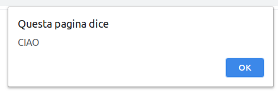

**Javascript** è il linguaggio che permette di **creare animazioni** nei contenuti web. Tutte le gallery, gli slider, i pop up, le transizioni di pagina e ogni effetto animato che vedi navigando online è realizzato con **Javascript**.

Questo linguaggio **si è sviluppato moltissimo**, passando dall’essere una cosa in più, un modo per creare effetti divertenti e simpatici, ad essere oggi uno dei più utilizzati al mondo, non solo per animazioni. ma per creare **vere e proprie strutture software** in grado di far funzionare applicativi potentissimi.

In questo articolo **tratteremo le basi**, partiremo **da zero** e vedremo come funziona questo linguaggio di programmazione, e creeremo insieme qualcosa di **semplice** ma utile per capire come utilizzare questo linguaggio.

Faremo prima un po’ di teoria e poi passeremo a creare qualcosa di utilizzabile sulla nostra pagina web.

Se ti perdi durante l’articolo sul fondo di questo articolo potrai trovare il codice di tutto ciò che andremo a creare.

* * *

_Questo corso è rivolto ai **principianti**, pertanto se conosci già Javascript questo articolo non fa per te, se invece sei agli inizi **BENVENUTO** e buono studio! Vedrai che **imparerai presto** a cerare fantastici contenuti web!_

* * *

## Inserire Javascript nell’HTML

Iniziamo ad **inserire** del codice Javascript nel nostro file html (se non sai di cosa sto parlando dai un’occhiata ai nostri articoli su [HTML](/guide/le-basi-dellhtml/) e [CSS](/guide/le-basi-del-css/))

Come per il codice CSS, anche il Javascript può essere inserit in **modi diversi:**

- Javascript interno
- Javascript esterno

### Codice Javascript interno

In questo caso il codice Javascript è inserito **direttamente nel file html** prima del fine body (</body>), fra i tag _**<script>**_ e **</script>.**

**Esempio:**

Apriamo il nostro “**index.html**“, andiamo sul fondo e inseriamo questo codice appena prima del tag _**</body>**_:

```
<script>
   alert("CIAO");
</script>
```

Ora **salviamo** e **apriamo** la pagina “index.html”. Ecco che apparirà un **popup** con scritto “CIAO!”.



## Codice Javascript esterno

Per inserire il javascript esterno occorre **creare un file .js** e **importarlo** nell’html. Come per il CSS questo è **il metodo migliore**, quasi sempre.

**Esempio:**

Andiamo nella nostra cartella “**HTML**” sul desktop, la apriamo con code (guadra la guida [Le basi di HTML](/guide/le-basi-dellhtml/)) e creiamo un file (**CTRL+N**) e lo salviamo (**CTRL+S**) con il nome “_**scripts.js**_“.

All’interno di questo file scriviamo:

```
alert("CIAO");
```

Ora **salviamo** “**_scripts.js_**” e apriamo “**_index.html_**“.

Qua, sempre prima del _</body>_, inseriamo questo:

```
<script src="scripts.js"></script>
```

Ora **salviamo** e **aggiorniamo** il browser.

**Il risultato è uguale a prima**: il popup, solo che il modo con cui l’abbiamo fatto apparire è diverso.

## Un po’ di teoria

### Alert

Abbiamo appena utilizzato la funziona “**alert**“, che permette di far apparire un **popup** nella pagina web con del testo al suo interno. Raramente questo è utilizzato per i popup, perché l**‘estetica è un po’ bruttina** ed esistono metodi molto migliori per far comparire dei popup nelle pagine web, ma può essere molto utile **in fase di debugging**.

Se sto creando una funzione e non riesco a trovare l’errore, posso inserire un “alert” a metà funzione e vedere così se l’errore si verifica prima o dopo.

### Console.log

Un altro modo per visualizzare errori in Javascript è la funzione “**console.log**“. Questa permette di **inserire del testo nella console di Javascript**. Anche questa è molto utile in fase di debug e sviluppo.

**Ecco un esempio:**

```
console.log("CIAO!");
```

Se inserisci questa in “_**scripts.js**_“, salvi e aggiorni, non vedrai accadere niente. Questo perché il **“CIAO!”** che abbiamo scritto **è inserito nella console di Javascript**, non nel body della pagina. Per vedere la console Javascript premi il tasto “**f12**“, oppure fai click con il tasto destro e clicca su “**ispeziona**” (Su google chrome, ma è molto simile su tutti i browser)


### Commenti

I **commenti** sono **importantissimi** in ogni linguaggio di programmazione.

Per inserire i commenti in Javascript esistono **due modi:**

Se il commento è su **una sola riga** puoi inserire un **doppio slash** prima della riga. In questo modo **tutta la riga sarà commentata.**

**Esempio**

```
// Questo è un commento su una riga Javascript
```

Se invece **il commento è più lungo**, puoi usare la stessa sintassi del CSS: **_/\* Commento \*/_**

**Esempio:**

```
/*
Questo è un commento
Javascript su più righe
*/
```

### Variabili

A differenza di HTML e CSS, **Javscript è un vero e proprio linguaggio di programmazione**, e non dei più semplici.

Come ogni linguaggio di prograammazione è possibile **utilizzare delle variabili per memorizzare i dati e fare calcoli.**

Inserire una variabile è molto semplice, basta inserire “**var**” prima della variabile, in questo modo:

```
var anni = 30;
```

È fondamentale **inserire il punto e virgola** alla fine della variabile, per indicare che la regola finisce in quel punto. Senza il punto e virgola verranno generati degli errori.

Ora possiamo **richiamare la variabile dentro il console.log** oppure in un **alert**, in questo modo:

```
console.log(anni);
```

oppure:

```
alert(anni);
```

**Salviamo** e **aggiorniamo** e vedremo il numero “**30**” apparire nel popup oppure nella cosole.

**Ma possiamo fare di più!**

Impostiamo **una serie di variabili:**

```
var nome = "Marco";
var altezza = "1.83";
var anni = 30;
```

Adesso possiamo c**reare una frase ed inserire al suo interno le nostre variabili,** oltre che utilizzarle per fare dei calcoli.

I **valori testuali devono essere inseriti fra virgolette**, mentre i **valori numerici senza**. In questo modo possiamo fare anche delle **operazioni aritmetiche.**

**Ecco un esempio:**

```
console.log('Ciao, mi chiamo ' + nome + ' e sono alto ' + altezza + ' metri. In questo momento ho ' + anni + ' anni. Fra 5 anni avrò ' + (anni + 5) + ' anni.'); </script>
```

Per inserire una **variabile in un testo** occorre **concatenarla**, metterla insieme.

Per fare questo abbiamo utilizzato il segno **‘+’.**

### Funzioni

Le funzioni sono delle **parti di codice che svolgono una determinata azione**.

Isolando una parte di codice in una funzione, questa potrà essere **richiamata** più volte all’interno del progetto.

Le funzioni possono avere dei **parametri**, che ne personalizzano l’azione.

**Esempio:**

Andiamo sul file _**scripts.js**_ e scriviamo:

```
function ciao() {
   alert ("CIAO");
}
```

Ora andiamo sul file _**index.htm**_l e aggiungiamo un bottone, in questo modo:

```
<button onclick="ciao()">Salutami</button>
```

**Salviamo** e **aggiorniamo** e vedremo che **cliccando sul nuovo bottone apparirà il popup con scritto “CIAO”.**

### Parametri

Adesso aggiungiamo un **parametro**. Andiamo nella funzione a la modifichiamo così:

```
function ciao(nome) {
    alert ("CIAO "+nome);
 }
```

e sul file _**index.html**_ modifichiamo così il bottone:

```
<button onclick="ciao('Marco')">Salutami</button>
```

**Salviamo** e **aggiorniamo** e possiamo vedere che ora il saluto è rivolto al nome inserito nel parametro della funzione!

“Marco” è il nostro parametro

### If Else

Gli “If” sono **alla base di tutta la programmazione**. Ogni azione è fatta come conseguenza di un’altra. Vediamo cosa significa.

Utilizziamo sempre il bottone del saluto. Possiamo prevedere che se il nome è “Marco” allora il popup dirà “Ciao Marco”, se invece il nome è “Mark”, possiamo far apparire “Hello Mark”.

**Vediamo come fare:**

Sostituiamo la funzione con questa:

```
function ciao(nome) {
    if(nome=="Marco"){
        alert ("CIAO "+nome);
    }else if(nome=="Mark"){
        alert ("Hello "+nome);
    }else{
        alert ("Buongiorno "+nome);
    }
 }
```

Ora possiamo andare a **modificare il parametro nel bottone**, da “Marco” a “Mark”, oppure inserire un nome totalmente diverso.

Se il nome è Marco allora il popup sarà “Ciao Marco”, se Mark allora “Hello Mark”, se altro sarà “Buongiorno + nome”.

Da notare come **ci siano due segni uguale**, questo perché nel Javascript un uguale assegna il valore, per confrontarli invece occorre usarne 2 o 3 a seconda dei casi. Per il momento ci basta sapere che quando dobbiamo connfrontare più valori bisogna inserire 2 segni uguale.

### Eventi

**Il Javascript può essere richiamato all’interno dell’HTML all’accadere di determinati eventi,** per esempio al click, al passaggio con il mouse etc.

Oggi esistono anche molti altri modi, ma per iniziare questi sono i più semplici ed immediati.

**Esempio:**

```
<button onclick="alert('CIAO!')">Salutami</button>
```

In questo caso al click del bottone apparirà il **popup di saluto.**

## Creiamo il nostro primo effetto

Al di là della teoria, **a noi interessa soprattutto vedere come possiamo utilizzare Javascript per creare gli effetti per le nostre pagine web.**

Quindi ora andremo a **creare un semplice effetto che cambierà lo sfondo del body al click di un bottone.**

**Vediamo come fare:**

Iniziamo con il creare un bottone nella nostra _**index.html:**_

```
<button onclick="cambiaSfondo()"> Cambia sfondo! </button>
```

Ora andiamo nel nostro **_scripts.js_** e creiamo la funzione **cambiaSfondo()**:

```
function cambiaSfondo(){
   document.body.style.backgroundColor='#000';
}
```

Se **salviamo** e **aggiorniamo** vedremo che ora **al click del bottone lo sfondo diventerà nero.**

Abbiamo detto al browser che al click del bottone deve selezionare il colore di sfondo del body (body.style.backgroundcolor) e impostarlo a nero.

Notiamo però che **è un’unica azione**, una volta che lo sfondo è nero non possiamo più tornare al bianco…

**Andiamo ad aggiungere ancora qualche linea di codice:**

```
function cambiaSfondo(){
    var sfondo = document.body.style.backgroundColor;
    if(sfondo=="rgb(0, 0, 0)"){
        document.body.style.backgroundColor='#fff';
    }else{
        document.body.style.backgroundColor='#000';

    }
}
```

In questo modo facciamo un **controllo del colore di sfond**o. Se è nero lo impostiamo bianco, altrimento sarà nero.

Così facendo possiamo **cambiare colore di sfondo ogni volta che clicchiamo sul bottone.**

**Congratulazioni! Hai appena creato il tuo primo effetto Javascript!!!**

## Animazione di un componente

Se al posto dello sfondo intero volessimo modificare solamente un **componente**, possiamo farlo utilizzando gli **id** ([Le basi di CSS](/guide/le-basi-del-css/)).

Iniziamo con il creare un **div con id=”box”**

```
<div id="box" onmouseover="cambiaBoxOver()" onmouseout="cambiaBoxOut()">
   Questo contenitore cambiarà colore al passaggio del mouse
</div>
```

Ora **creiamo le due funzioni in scripts.js:**

```
 function cambiaBoxOver(){
    document.getElementById('box').style.backgroundColor="coral";
    document.getElementById('box').style.color="blue";
}

 function cambiaBoxOut(){
    document.getElementById('box').style.backgroundColor="white";
    document.getElementById('box').style.color="black";

}
```

**Salviamo** e **aggiorniamo** e vediamo che **il contenitore cambia colore e sfondo al passaggio del mouse.**

Molto bene, **queste sono le basi per iniziare a smanettare un po’ con il Javascript.**

**Cercando online potrai trovare moltissime guide e tutorial sull’argomento.**

**È però bene conoscere anche un po’ di Javascript** e soprattutto JQuery, per poter **evitare di installare un’infinità di plugin e crearci da soli tutti gli effetti e le funzioni che vogliamo!**

### CODICE COMPLETO:

**index.html**

```
<!DOCTYPE html>
<html lang="en">

<head>
    <meta charset="UTF-8">
    <meta name="viewport" content="width=device-width, initial-scale=1.0">
    <title>La mia prima pagina web</title><!-- Il titolo della pagina che appare nella scheda del browser -->
    <link rel="stylesheet" href="style.css">
</head>

<body>
    <div class="container">

        <!-- Javascript -->
        <button onclick="ciao('Ugo')">Salutami</button>
        <!-- Titolo -->
        <button onclick="cambiaSfondo()">
            Cambia sfondo!
        </button>
        <div id="box" onmouseover="cambiaBoxOver()" onmouseout="cambiaBoxOut()">
            Questo contenitore cambiarà colore al passaggio del mouse
        </div>
        <!-- /Javascript-->

        <h1>La mia prima pagina web</h1>

        <!-- Paragrafo -->
        <p>Benvenuto nella mia prima pagina web!</p>

        <br><!-- questo è un a capo-->

        <!-- Sottotitolo -->
        <h2>Sottotitolo</h2>

        <p>Questo è il secondo paragrafo della mia prima pagina web</p>

        <br>

        <h2>Elenco</h2>
        <!-- Elenco -->
        <ul>
            <li>Primo Item</li><!-- Item di un elenco -->
            <li>Secondo Item</li>
        </ul>

        <!-- Immagine
     -->

        <!-- DIV: block element -->
        <div style="background-color: green;">
            Questo è un contenitore con sfondo verde
        </div>

        <!-- SPAN: inline element -->
        <p>
            Questo è un paragrafo con del testo inserito a caso. In questo testo voglio
            <span style="color:red">colorare</span> una parola di rosso
        </p>

        <!-- FORM -->
        <form>
            <!-- Casella di testo -->
            <input type="text" placeholder="Nome">
            <br><br>
            <input type="text" placeholder="Cognome">
            <br><br>
            <!-- Menù a tendina -->
            <select name="select" id="">
                <option value="0">Opzione 1</option>
                <option value="1">Opzione 2</option>
                <option value="2">Opzione 3</option>
            </select>
            <br><br>
            <!-- Area di testo -->
            <textarea name="" id="" cols="30" rows="10" placeholder="Inserisci il testo qui."></textarea>
            <br><br>
            <!-- Checkbox-->
            <input type="checkbox" name="privacy" value="0">Accetto la Privacy Policy
            <br><br>
            <!-- Bottone -->
            <button>Invia</button>
        </form>

        <h2>Margin e Padding</h2>
        <h3>Margin:</h3>
        <div class="box-margin">
            Questo è un box con del margine
        </div>

        <div class="box-margin-top">
            Questo box ha solo il margine superiore
        </div>

        <h3>Padding</h3>
        <div class="box-padding">
            Questo è un box con del padding
        </div>

        <!--
<div class="immagine-sfondo">
    Questo div ha un'immagine di sfondo!
</div>
-->

    </div>

    <script src="scripts.js"></script>
</body>

</html>
```

**scripts.js**

```
function cambiaSfondo(){
    var sfondo = document.body.style.backgroundColor;
    if(sfondo=="rgb(0, 0, 0)"){
        document.body.style.backgroundColor='#fff';
    }else{
        document.body.style.backgroundColor='#000';

    }
}

function ciao(nome) {
    if(nome=="Marco"){
        alert ("CIAO "+nome);
    }else if(nome=="Mark"){
        alert ("Hello "+nome);
    }else{
        alert ("Buongiorno "+nome);
    }

 }

 function cambiaBoxOver(){
    document.getElementById('box').style.backgroundColor="coral";
    document.getElementById('box').style.color="blue";
}

 function cambiaBoxOut(){
    document.getElementById('box').style.backgroundColor="white";
    document.getElementById('box').style.color="black";

}
```

_[<< Le basi di CSS](/guide/le-basi-dellhtml/)_

_[Le basi di Bootstrap >>](/guide/le-basi-di-bootstrap/)_
