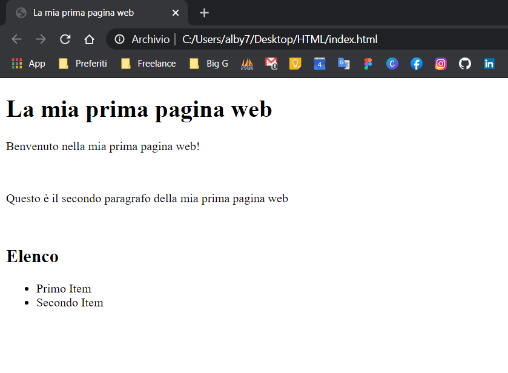

_Ho effettuato un nuovo commit a questo progetto, aggiornandolo a PDO, inserendo i bindparam per aumentare la sicurezza e variando leggermente l’architettura software. Il codice aggiornato è nella repository github indicata nell’articolo._

È vero, oggi esistono una **miriade di CMS e framework** in giro già belli che pronti, basta installarli e voilà! Il gioco è fatto!

Tutti hanno un sistema di login per poter accedere ad un’area riservata!

Però io sono sempre stato uno di quelli che non si accontentano della _pappa pronta_ ma vogliono _**imparare** a cucinare_.

Per questo ho deciso di **creare un CMS tutto mio**, partendo da zero e utilizzando solamente HTML, CSS, JS e PHP.

Una delle prime cose che ho dovuto realizzare con il mio CMS è stato proprio un **sistema di login** per accedere all’area riservata.

## Sistema di login in core PHP

Ho deciso ora di rendere **open source** un piccolo sistema di accesso ad un’area riservata.

Puoi trovare il codice sorgente di questo progettino sul [mio profilo github](https://github.com/alby-dev) a questo indirizzo: [ht](https://github.com/alby-dev/Simple-login-and-registration-in-php)[tps://github.com/alby-dev/Simple-login-and-registration-in-php](https://github.com/alby-dev/Simple-login-and-registration-in-php)

Tralasciamo sistemi di routing e architettura software e **facciamola semplice,** parliamo solo del login nudo e crudo.

### Area riservata

Innanzitutto ho creato una cartella “**login**“, dentro la quale ci saranno i file dell’area riservata.

Se non ho ancora effettuato l’accesso allora vedrò il **form di login.**


Nella **index.php** nella cartella login ho quindi inserito il **form** per effettuale l’accesso all’area riservata, con il form che rimanda al file **access.php,** contenente le funzioni di controllo dei dati di accesso.

```
      <!-- Login form -->
      <form class="" action="access.php" method="POST">
        <!-- Action -->
        <input type="hidden" name="action" value="login">
        <!-- Email or Username -->
        <label for="email">Email or Username</label>
        <input autofocus name="email" type="text">
        <!-- Password -->
        <label for="password">Password</label>
        <input name="password" id="password" placeholder="" type="password">
        <!-- Login Button -->
        <button type="submit">Login</button>
      </form>
      <!-- /Login form -->
```

**Access.php** si occupa sia del **login** che della **registrazione** dei nuovi utenti. È un file che continene solo PHP, esegue i controlli e poi rimanda alla pagina corretta, in base al tipo di richiesta.

Se ho inserito i dati corretti allora rimanda nel **backend**.

Invece se ho inserito i dati sbagliati mi rimanda al form di login con messaggio di **errore**.

Se sto **creando un nuovo utente segue la prassi della registrazione**, inviando un’email di conferma con un link cliccando sul quale si confermerà il proprio account.



**access.php**

```
<?php
//Config File
include("config.php");

//Control Action
if ($_POST['action'] == "login") {
    /*------------------------------------------------------
                        LOGIN
    -------------------------------------------------------*/
    ///$_Post variables
    $email = $_POST['email'];
    $password = $_POST['password'];


    //Query
    $sql = "SELECT * FROM users WHERE email = '" . $email . "' OR username ='" . $email . "'";
    $result = $conn->query($sql);
    if ($result->num_rows > 0) {
        while ($row = $result->fetch_assoc()) {

            //Password control
            if (!(password_verify($password, $row["password"]))) {
                header("location: error.php?error=Wrong Password");
                die();
            }

            //Start Session
            session_start();

            //Save user id in session
            $_SESSION['id'] = $row["id"];

            //Redirect to backend homepage
            header("location: welcome.php");
            die();
        }
    } else {
        header("location: error.php?error=Wrong Email or Username");
        die();
    }
} elseif ($_POST['action'] == "register") {
     /*------------------------------------------------------
                        REGISTER
    -------------------------------------------------------*/
    $email = $_POST['email'];
    $username = $_POST['username'];
    $password = $_POST['password'];

    //Control if the user or email are already in the database
    $sql = "SELECT * FROM users WHERE email = '" . $email . "' OR username = '" . $username . "'";
    $result = $conn->query($sql);
    if ($result->num_rows > 0) {
        while ($row = $result->fetch_assoc()) {
            header("location: error.php?error=Email or Username already register!");
        }
    }


    //Insert new user in DB
    $password = password_hash($password, PASSWORD_DEFAULT);
    $sql = "INSERT INTO users (username,email,password)
    VALUES (
    '" . $username . "',
    '" . $email . "',
    '" . $password . "'
    )";
    if ($conn->query($sql) === TRUE) {
        header("location: index.php");
    } else {
        header("location: error.php?error=" . $conn->error);
    }
}
$conn->close();
```

### Database

Il database è un MySQL molto semplice, con una tabella “**users**” contenente i dati dell’utente e la **password criptata.**

Per **bloccare gli utenti non loggati** e consentire l’accesso solamente ai loggati è possibile utilizzare le variabili **session**, da includere in ogni file del backend. In questo modo l’accesso viene consentito solamente a chi è passato tramite il form di login. Questo passaggio non è presente su github ma è molto semplice da integrare, forse lo aggiungerò quando avrò tempo!

Spero possa essere stato **utile** e **interessante**.

Se vuoi **utilizzare** questo form o provarelo e **migliorarlo** segui le **istruzioni** nel file readme.txt presente su github.

_Buon codice!_
